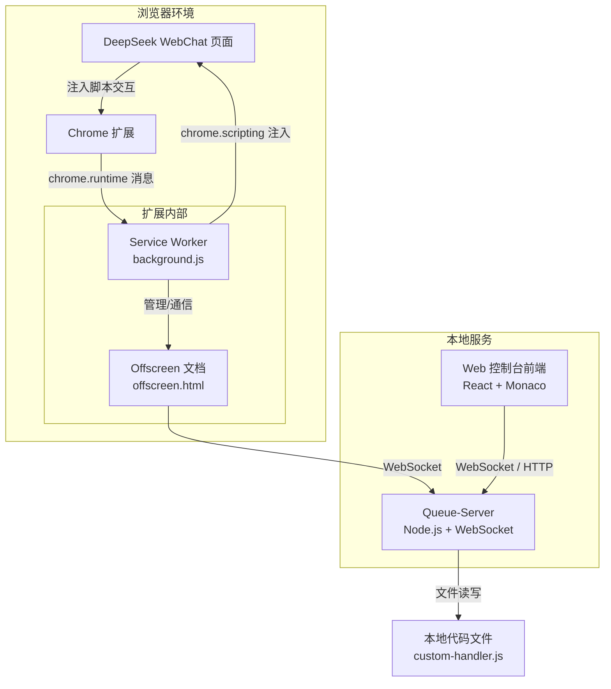
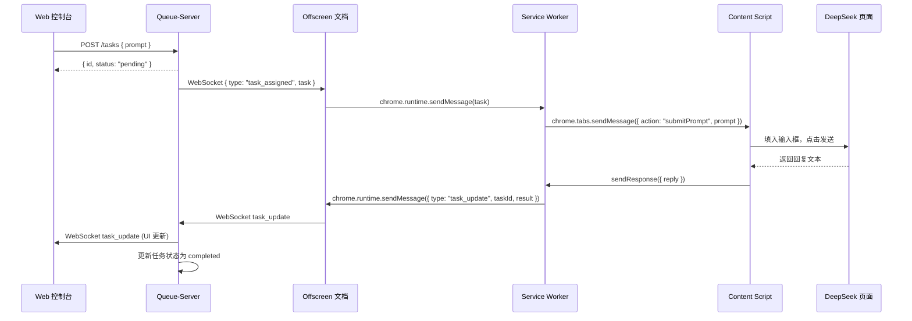

# DeepSeek 自动化编程代理系统 - 详细设计文档 v0.1

| 文档版本 | 日期 | 作者 | 变更说明 |
| :--- | :--- | :--- | :--- |
| v0.1 | 2026-04-08 | 系统设计 | 初始版本，定义最小可行框架 |

## 1. 项目概述

### 1.1 目标

构建一个可自我进化的本地开发辅助系统，通过 Chrome 扩展自动与 DeepSeek WebChat 交互，并提供一个带有 VS Code 风格编辑器的 Web 控制台，用于任务管理和系统迭代。

### 1.2 核心特性

*   **本地部署**：所有组件均运行在开发者本机。
*   **自动化交互**：Chrome 扩展在后台与 DeepSeek 网页自动对话。
*   **队列调度**：Queue-Server 负责任务排队、分发与状态管理。
*   **可视化控制台**：基于 Web 的任务管理界面，内嵌 Monaco 编辑器。
*   **自我进化**：支持修改 Queue-Server 代码后热重载，实现“元认知”迭代。

### 1.3 技术栈

| 组件 | 技术选型 |
| :--- | :--- |
| Queue-Server | Node.js (≥18) + Express + ws (WebSocket) |
| 包管理 | npm / pnpm |
| Chrome 扩展 | Manifest V3 + Offscreen 文档 |
| Web 控制台前端 | Vite + React + TypeScript + Monaco Editor |
| 进程管理 | nodemon (开发热重载) |
| 辅助工具 | ffmpeg (可选，预留音视频处理能力) |

## 2. 系统架构

### 2.1 架构图



### 2.2 组件职责

| 组件 | 职责描述 |
| :--- | :--- |
| **Queue-Server** | - 维护内存任务队列<br>- 通过 WebSocket 与扩展双向通信<br>- 提供 RESTful API 供控制台管理任务<br>- 支持热重载以实现代码进化 |
| **Chrome 扩展 (Offscreen 文档)** | - 维护与 Queue-Server 的持久 WebSocket 连接<br>- 接收任务并通过 Service Worker 调度<br>- 向 DeepSeek 页面注入脚本并捕获回复 |
| **Chrome 扩展 (Service Worker)** | - 管理 Offscreen 文档生命周期<br>- 处理扩展事件（安装、消息中继）<br>- 调用 `chrome.scripting` 注入内容脚本 |
| **Web 控制台** | - 提供任务输入界面（带 Monaco 编辑器）<br>- 展示任务列表和结果<br>- 提供“进化”接口，允许修改并重载 Queue-Server 代码 |

## 3. 模块详细设计

### 3.1 Queue-Server

#### 3.1.1 目录结构

```
queue-server/
├── index.js          # 入口文件
├── package.json
├── routes/
│   └── tasks.js      # RESTful API 路由
├── websocket/
│   └── handler.js    # WebSocket 连接管理与消息处理
├── queue/
│   └── manager.js    # 任务队列逻辑（内存）
├── evolution/
│   └── hot-reload.js # 热重载触发器
└── custom-handler.js # 用户可进化的自定义逻辑模块
```

#### 3.1.2 API 设计

| 方法 | 路径 | 功能 | 请求体 | 响应 |
| :--- | :--- | :--- | :--- | :--- |
| GET | `/tasks` | 获取所有任务及下一个待处理任务 | - | `{ tasks, nextPending }` |
| POST | `/tasks` | 添加新任务 | `{ url?, prompt, options }` | `{ id, status }` |
| PATCH | `/tasks/:id` | 更新任务状态 | `{ status, result?, error? }` | `{ success }` |
| POST | `/evolve` | 进化：保存新代码并触发重载 | `{ code }` | `{ message }` |
| GET | `/health` | 健康检查 | - | `{ status: "ok" }` |

#### 3.1.3 WebSocket 消息协议

**扩展 → 服务器**

| 事件 | 数据结构 | 说明 |
| :--- | :--- | :--- |
| `register` | `{ type: "register", clientType: "extension" }` | 扩展注册 |
| `task_update` | `{ type: "task_update", taskId, status, result? }` | 任务状态更新 |
| `ping` | `{ type: "ping" }` | 心跳 |

**服务器 → 扩展**

| 事件 | 数据结构 | 说明 |
| :--- | :--- | :--- |
| `task_assigned` | `{ type: "task_assigned", task }` | 推送新任务 |
| `pong` | `{ type: "pong" }` | 心跳响应 |

#### 3.1.4 热重载机制

*   使用 `nodemon` 监听 `queue-server/` 目录变化，自动重启进程。
*   `/evolve` 接口接收代码字符串，将其写入 `custom-handler.js`，然后触发 `process.exit(0)` 使 nodemon 重启。
*   `custom-handler.js` 应导出一个函数 `processTask(task)`，供任务执行时调用，实现可进化的业务逻辑。

### 3.2 Chrome 扩展

#### 3.2.1 目录结构

```
chromevideo/
├── manifest.json
├── background.js       # Service Worker
├── offscreen.html
├── offscreen.js        # Offscreen 文档脚本
├── content.js          # 注入到 DeepSeek 页面的脚本
├── icons/
│   └── icon128.png
└── utils/
    └── messaging.js    # 消息传递工具函数
```

#### 3.2.2 Manifest 关键配置

```json
{
  "manifest_version": 3,
  "name": "DeepSeek Agent Bridge",
  "version": "0.1.0",
  "permissions": [
    "offscreen",
    "storage",
    "scripting",
    "webNavigation"
  ],
  "host_permissions": [
    "https://chat.deepseek.com/*",
    "http://localhost:8080/*"
  ],
  "background": {
    "service_worker": "background.js"
  },
  "content_scripts": [
    {
      "matches": ["https://chat.deepseek.com/*"],
      "js": ["content.js"],
      "run_at": "document_idle"
    }
  ]
}
```

#### 3.2.3 Offscreen 文档创建逻辑 (background.js)

```javascript
// 确保 Offscreen 文档存在
async function ensureOffscreen() {
  const existing = await chrome.offscreen.hasDocument();
  if (!existing) {
    await chrome.offscreen.createDocument({
      url: 'offscreen.html',
      reasons: ['DOM_SCRAPING'], // 借用此理由维持 WebSocket
      justification: 'Maintain WebSocket connection to local server'
    });
  }
}

// 启动时立即创建
chrome.runtime.onStartup.addListener(ensureOffscreen);
chrome.runtime.onInstalled.addListener(ensureOffscreen);
```

#### 3.2.4 Offscreen 文档中的 WebSocket 客户端 (offscreen.js)

```javascript
let ws;
const WS_URL = 'ws://localhost:8080';

function connect() {
  ws = new WebSocket(WS_URL);
  ws.onopen = () => {
    ws.send(JSON.stringify({ type: 'register', clientType: 'extension' }));
    // 启动心跳
    setInterval(() => ws.send(JSON.stringify({ type: 'ping' })), 30000);
  };
  ws.onmessage = (event) => {
    const msg = JSON.parse(event.data);
    // 转发给 Service Worker
    chrome.runtime.sendMessage(msg);
  };
  ws.onclose = () => setTimeout(connect, 5000);
}

connect();

// 接收来自 Service Worker 的消息并发送到服务器
chrome.runtime.onMessage.addListener((msg, sender, sendResponse) => {
  if (ws && ws.readyState === WebSocket.OPEN) {
    ws.send(JSON.stringify(msg));
  }
});
```

#### 3.2.5 任务执行流程 (background.js)

1. 监听来自 Offscreen 的 `task_assigned` 消息。
2. 调用 `executeDeepSeekTask(task)`：
    *   检查 DeepSeek 页面是否已打开，若无则 `chrome.tabs.create`。
    *   通过 `chrome.tabs.sendMessage` 将任务内容发送给 `content.js`。
3. 监听来自 `content.js` 的回复，并通过 Offscreen 上报 `task_update`。

#### 3.2.6 内容脚本 (content.js)

```javascript
// 监听来自 background 的消息
chrome.runtime.onMessage.addListener((msg, sender, sendResponse) => {
  if (msg.action === 'submitPrompt') {
    const prompt = msg.prompt;
    // 找到输入框并填入（选择器需根据 DeepSeek 页面更新）
    const input = document.querySelector('textarea');
    if (input) {
      input.value = prompt;
      // 模拟输入事件
      input.dispatchEvent(new Event('input', { bubbles: true }));
      // 点击发送按钮
      setTimeout(() => {
        const sendBtn = document.querySelector('button[type="submit"]');
        sendBtn?.click();
      }, 500);
      
      // 监听回复（简化版：轮询新消息）
      waitForReply().then(reply => {
        sendResponse({ success: true, reply });
      });
      return true; // 保持异步响应
    }
  }
});

function waitForReply() {
  // 实现 DOM 监听，捕获 AI 最新回复
  // 可基于 MutationObserver 或定时检查新增的消息气泡
  // 返回 Promise
}
```

### 3.3 Web 控制台前端

#### 3.3.1 页面布局

*   **左侧面板**：任务列表（显示任务ID、状态、时间）
*   **右侧上部**：任务输入区域，包含一个 Monaco Editor 用于输入 Prompt
*   **右侧下部**：结果展示区域，显示 AI 回复内容
*   **顶部工具栏**：包含“进化”按钮，点击打开代码编辑器弹窗

#### 3.3.2 核心功能

*   **任务提交**：通过 `POST /tasks` 创建任务。
*   **任务状态同步**：建立 WebSocket 连接，监听 `task_update` 事件更新 UI。
*   **进化功能**：调用 `/evolve` 接口，将 Monaco 编辑器中的代码字符串发送给服务器。

#### 3.3.3 技术实现要点

*   使用 `vite` 搭建项目，配置代理将 `/api` 转发至 `http://localhost:8080`。
*   Monaco Editor 使用 `@monaco-editor/react` 组件。
*   状态管理使用 React Hooks (`useState`, `useEffect`)。

## 4. 数据流与交互时序

### 4.1 一次完整任务请求流程



### 4.2 自我进化流程

1.  用户在 Web 控制台的 Monaco 编辑器中修改 `custom-handler.js` 的代码。
2.  点击“进化”按钮，前端发送 `POST /evolve` 携带代码字符串。
3.  Queue-Server 将代码写入 `custom-handler.js`。
4.  Queue-Server 主动退出进程 (`process.exit(0)`)。
5.  `nodemon` 检测到进程退出，自动重启服务，加载新代码。
6.  Chrome 扩展的 WebSocket 检测到断开，自动重连，系统以新逻辑运行。

## 5. 实施路线图（迭代计划）

### 迭代 0：基础骨架 (2天)
*   [x] 初始化 `queue-server` 项目，实现基础 HTTP 服务器和 WebSocket 服务。
*   [x] 实现内存任务队列 (`queue/manager.js`)。
*   [x] 创建 Chrome 扩展骨架，配置 Manifest，实现 Offscreen 文档创建和 WebSocket 连接。
*   [x] 验证扩展与 Queue-Server 的 WebSocket 双向通信。

### 迭代 1：最小可用闭环 (3天)
*   [x] 实现 Web 控制台基础界面（任务列表 + 输入框）。
*   [x] 实现任务创建 API 和任务状态更新。
*   [x] 实现扩展的内容脚本注入和简单回复捕获（手动测试，用固定选择器）。
*   [x] 端到端测试：控制台提交任务 -> 扩展执行 -> 结果返回控制台。

### 迭代 2：编辑器与进化基础 (2天)
*   [x] 集成 Monaco Editor 到控制台。
*   [x] 实现 `/evolve` API 和热重载机制。
*   [x] 验证修改 `custom-handler.js` 后系统行为变化。

### 迭代 3：健壮性与体验优化 (后续)
*   [ ] 添加任务持久化（本地 JSON 文件）。
*   [ ] 实现扩展自动重载机制（开发模式）。
*   [ ] 优化 DeepSeek 页面交互，增加防检测措施（随机延迟、模拟人类打字）。
*   [ ] 支持多个 DeepSeek 账号 Token 池化（可选）。

## 6. 验收标准

*   **通信链路**：Queue-Server 启动后，Chrome 扩展能自动连接并维持 WebSocket。
*   **任务闭环**：在 Web 控制台提交一个 Prompt，能在 30 秒内看到 DeepSeek 的回复显示在结果区。
*   **自我进化**：通过 Web 控制台修改 `custom-handler.js` 中的处理逻辑（例如在回复前添加前缀），保存后系统能按新逻辑运行。
*   **稳定性**：Queue-Server 或扩展意外断开后，能自动重连恢复。

## 7. 风险与应对

| 风险 | 影响 | 缓解措施 |
| :--- | :--- | :--- |
| DeepSeek 页面 DOM 变更导致选择器失效 | 功能完全不可用 | 采用模糊选择器 + 定期人工维护；预留降级至官方 API 的方案 |
| Chrome 扩展 Service Worker 频繁休眠 | WebSocket 连接不稳定 | 使用 Offscreen 文档维持连接，实现健壮重连 |
| 违反 DeepSeek 服务条款导致账号封禁 | 服务中断 | 明确告知用户风险，仅供个人技术研究；建议过渡到官方 API |
| 本地热重载失败 | 进化功能失效 | 使用 nodemon 成熟方案，提供手动重启备选说明 |

## 8. 附录：开发环境快速启动

```bash
# 1. 启动 Queue-Server
cd queue-server
npm install
npm run dev   # 使用 nodemon

# 2. 启动 Web 控制台
cd web-console
npm install
npm run dev

# 3. 加载 Chrome 扩展
# 打开 chrome://extensions，开启“开发者模式”，加载 chromevideo 目录
```
