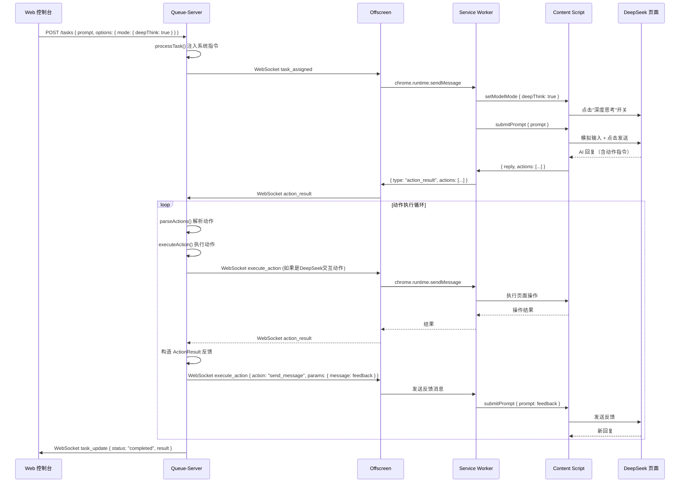
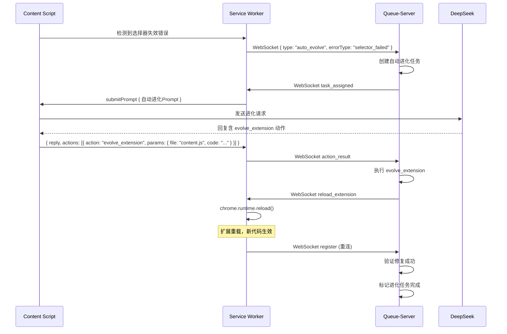

> Deprecated: 本文档描述的是 2026-04-25 前的自动进化/自修改路线，已从当前主线中移除。当前路线以 `doc/refactor-prune-plan-20260425.md` 和 `doc/refactor-prune-plan-20260425-v1.md` 为准。

# ChromeVideo 扩展功能规划 - DeepSeek 自动化代理桥

| 文档版本 | 日期 | 作者 | 变更说明 |
| :--- | :--- | :--- | :--- |
| v1.0 | 2026-04-10 | 系统架构 | 完整功能规划，定义 Agent 能力协议与自动进化闭环 |

## 1. 概述

### 1.1 目标

将 ChromeVideo 扩展从"单向提交 Prompt + 等待回复"的简单桥接，升级为 **双向 Agent 桥**：

- 扩展能**读取** DeepSeek 页面的完整状态（聊天内容、会话列表、模型模式、标签等）
- 扩展能**操控** DeepSeek 页面的所有交互（切换模型、上传截图、创建/切换会话等）
- 扩展能**注入系统指令**，让 DeepSeek 知道它可以通过结构化回复触发本地动作
- DeepSeek 的回复中可以包含**动作指令**，扩展解析并执行，将结果反馈回 DeepSeek
- 形成 **感知 → 思考 → 行动 → 反馈** 的自动进化闭环

### 1.2 核心设计原则

1. **能力声明式**：扩展在每次对话开始时注入系统提示，明确告知 DeepSeek 可用的动作列表和调用格式
2. **动作协议化**：DeepSeek 通过约定的 JSON 格式在回复中嵌入动作指令，扩展解析执行
3. **反馈闭环**：每个动作执行后，结果自动作为新消息发送回 DeepSeek，形成多轮交互
4. **渐进增强**：新功能以模块化方式添加，不破坏现有流程
5. **安全边界**：危险动作（文件写入、命令执行）需经用户确认或受白名单约束

## 2. 功能模块总览

```
┌─────────────────────────────────────────────────────────────────┐
│                    ChromeVideo 扩展功能架构                       │
├─────────────┬─────────────┬──────────────┬─────────────────────┤
│  感知层      │  操控层      │  Agent 层     │  进化层              │
│  (Read)     │  (Write)    │  (Protocol)  │  (Evolution)        │
├─────────────┼─────────────┼──────────────┼─────────────────────┤
│ 读取聊天内容 │ 提交Prompt  │ 系统指令注入  │ 自我修改扩展代码      │
│ 读取会话列表 │ 切换模型模式 │ 动作指令解析  │ 自我修改Handler逻辑   │
│ 读取模型状态 │ 深度思考开关 │ 动作执行引擎  │ 自动提交进化任务      │
│ 读取标签     │ 智能搜索开关 │ 结果反馈循环  │ 版本回滚与恢复        │
│ 读取截图/PDF │ 上传文件    │ 多轮对话编排  │ 能力自描述更新        │
│ 读取代码块   │ 创建新会话  │ 上下文管理    │                     │
│ 读取页面状态 │ 切换/删除会话│ 错误恢复     │                     │
│             │ 截图捕获    │              │                     │
└─────────────┴─────────────┴──────────────┴─────────────────────┘
```

## 3. 感知层：读取 DeepSeek 页面状态

### 3.1 读取聊天内容

**功能描述**：获取当前会话中的完整聊天记录，包括用户消息和 AI 回复。

**API 定义**：

```javascript
// content.js 消息协议
{
  action: "readChatContent",
  params: {
    format: "text" | "markdown" | "structured",
    includeUserMessages: true,     // 是否包含用户消息
    includeAiMessages: true,       // 是否包含 AI 消息
    startIndex: 0,                 // 从第几条消息开始
    count: -1                      // -1 表示全部，正数表示条数
  }
}
```

**返回结构**：

```javascript
{
  success: true,
  data: {
    sessionId: "2a5d4a3a-0c06-46f5-b41d-3849b93cb1ec",
    sessionTitle: "处理evolve提示问题",
    messages: [
      {
        role: "user",
        content: "请帮我修改 custom-handler.js",
        timestamp: "2026-04-10T10:30:00Z",
        index: 0
      },
      {
        role: "assistant",
        content: "好的，我来帮你修改...",
        timestamp: "2026-04-10T10:30:15Z",
        index: 1,
        codeBlocks: [
          { language: "javascript", code: "module.exports = {...}" }
        ],
        thinkContent: "让我分析一下..."  // 深度思考内容（如果有）
      }
    ],
    totalMessages: 5
  }
}
```

**DOM 选择器策略**：

| 目标元素 | 选择器 | 降级策略 |
| :--- | :--- | :--- |
| 消息容器 | `.ds-chat-message` / `[class*="message"]` | 遍历所有 markdown 块反推 |
| 用户消息 | `[class*="user"]` / 消息容器奇偶索引 | 文本方向判断 |
| AI 消息 | `.ds-markdown` / `[class*="assistant"]` | markdown 块定位 |
| 深度思考内容 | `[class*="think"]` / `[class*="reasoning"]` | 折叠区域查找 |
| 代码块 | `pre code` / `.code-block` | markdown 内 pre 标签 |

### 3.2 读取会话列表

**功能描述**：获取侧边栏中的所有会话，包括标题、时间分组、URL 标识。

**API 定义**：

```javascript
{
  action: "readSessionList",
  params: {
    includeDates: true    // 是否包含时间分组信息
  }
}
```

**返回结构**：

```javascript
{
  success: true,
  data: {
    sessions: [
      {
        id: "2a5d4a3a-0c06-46f5-b41d-3849b93cb1ec",
        title: "处理evolve提示问题",
        href: "/a/chat/s/2a5d4a3a-0c06-46f5-b41d-3849b93cb1ec",
        dateGroup: "今天",
        isActive: true
      },
      {
        id: "051df7c8-463c-40f9-8fba-814faa98edf6",
        title: "curl代理连接问题排查",
        href: "/a/chat/s/051df7c8-463c-40f9-8fba-814faa98edf6",
        dateGroup: "今天",
        isActive: false
      }
    ],
    totalCount: 45
  }
}
```

**DOM 选择器**：`a[href*="/a/chat/s/"]`，时间分组通过父容器文本节点获取。

### 3.3 读取模型状态

**功能描述**：获取当前激活的模型模式和功能开关状态。

**API 定义**：

```javascript
{
  action: "readModelState",
  params: {}
}
```

**返回结构**：

```javascript
{
  success: true,
  data: {
    deepThink: {
      enabled: false,
      label: "深度思考"
    },
    search: {
      enabled: true,
      label: "智能搜索"
    },
    currentModel: "DeepSeek-V3"   // 如果页面有模型选择器
  }
}
```

**DOM 选择器**：`.ds-toggle-button`，通过 `ds-toggle-button--selected` 判断是否激活。

### 3.4 读取页面状态

**功能描述**：获取 DeepSeek 页面的整体运行状态，用于判断是否可执行操作。

**API 定义**：

```javascript
{
  action: "readPageState",
  params: {}
}
```

**返回结构**：

```javascript
{
  success: true,
  data: {
    isGenerating: false,          // AI 是否正在生成回复
    isInputReady: true,           // 输入框是否可用
    currentUrl: "https://chat.deepseek.com/a/chat/s/...",
    isLoggedIn: true,             // 是否已登录
    hasError: false,              // 页面是否有错误提示
    errorMessage: null            // 错误信息
  }
}
```

**检测策略**：
- `isGenerating`：检测是否存在"停止生成"按钮或加载动画
- `isInputReady`：检测 textarea 是否 disabled 或 readonly
- `isLoggedIn`：检测是否出现登录表单

### 3.5 读取最新回复

**功能描述**：仅获取 AI 的最新一条回复，用于快速轮询场景（替代现有的 waitForReply）。

**API 定义**：

```javascript
{
  action: "readLatestReply",
  params: {
    includeCodeBlocks: true,      // 是否提取代码块
    includeThinkContent: true     // 是否提取思考过程
  }
}
```

**返回结构**：

```javascript
{
  success: true,
  data: {
    content: "好的，这是修改后的代码...",
    codeBlocks: [
      { language: "javascript", code: "module.exports = {...}", filename: "custom-handler.js" }
    ],
    thinkContent: "我需要分析当前的handler逻辑...",
    isComplete: true,             // 回复是否生成完毕
    searchResults: [              // 智能搜索结果（如果有）
      { title: "...", url: "...", snippet: "..." }
    ]
  }
}
```

## 4. 操控层：操控 DeepSeek 页面交互

### 4.1 提交 Prompt（增强版）

**功能描述**：在当前会话中提交消息，支持系统指令前缀注入和模式预设。

**API 定义**：

```javascript
{
  action: "submitPrompt",
  params: {
    prompt: "请帮我修改 custom-handler.js",
    prependSystemInstruction: true,   // 是否自动添加系统指令前缀
    mode: {
      deepThink: false,               // 是否开启深度思考
      search: false                   // 是否开启智能搜索
    },
    attachments: [                    // 附件列表
      {
        type: "screenshot",           // screenshot | file | clipboard
        data: "base64...",            // base64 编码的图片数据
        filename: "screenshot.png"
      }
    ],
    typingSpeed: "human",             // human | fast | instant
    waitForReply: true,               // 是否等待回复
    replyTimeout: 120000              // 回复超时时间(ms)
  }
}
```

**增强点**：
- 支持在发送前自动切换深度思考/智能搜索模式
- 支持附件上传（截图、文件）
- 支持打字速度调节
- 支持不等待回复的"即发即忘"模式

### 4.2 切换模型模式

**功能描述**：控制深度思考和智能搜索的开关状态。

**API 定义**：

```javascript
{
  action: "setModelMode",
  params: {
    deepThink: true,     // true=开启, false=关闭, null=不改变
    search: null         // true=开启, false=关闭, null=不改变
  }
}
```

**实现策略**：
1. 查找 `.ds-toggle-button` 中包含"深度思考"/"智能搜索"文本的按钮
2. 检查当前状态（`ds-toggle-button--selected`）
3. 仅在需要切换时点击

### 4.3 上传文件/截图

**功能描述**：向 DeepSeek 上传图片或文件作为对话附件。

**API 定义**：

```javascript
{
  action: "uploadAttachment",
  params: {
    type: "image" | "file",
    data: "base64...",           // base64 编码的文件内容
    filename: "screenshot.png",
    mimeType: "image/png"
  }
}
```

**实现策略**：
1. 定位 `input[type="file"]` 元素
2. 通过 `DataTransfer` API 构造文件对象
3. 触发 `change` 事件

**支持的文件类型**（基于 DeepSeek 页面 accept 属性）：
- 图片：png, jpg, jpeg, gif, webp, svg, bmp 等
- 文档：pdf, txt, md, csv, json, log
- 代码：js, ts, py, go, java, cpp, c, css, html 等
- Office：doc, docx, ppt, pptx, xls, xlsx

### 4.4 截图捕获

**功能描述**：捕获当前页面或指定元素的截图，可直接上传给 DeepSeek。

**API 定义**：

```javascript
{
  action: "captureScreenshot",
  params: {
    target: "viewport" | "fullpage" | "element",
    elementSelector: ".ds-markdown",   // 当 target=element 时指定
    uploadToChat: true,                // 是否自动上传到当前对话
    returnBase64: true                 // 是否返回 base64 数据
  }
}
```

**实现策略**：
- 使用 `chrome.tabs.captureVisibleTab` 捕获视口截图
- 全页截图通过滚动 + 拼接实现
- 元素截图通过 canvas 裁剪实现

### 4.5 会话管理

**功能描述**：创建、切换、删除、重命名会话。

**API 定义**：

```javascript
// 创建新会话
{
  action: "createSession",
  params: {
    title: "新任务 - 代码优化"    // 可选，初始标题
  }
}

// 切换到指定会话
{
  action: "switchSession",
  params: {
    sessionId: "2a5d4a3a-0c06-46f5-b41d-3849b93cb1ec",
    // 或者通过标题模糊匹配
    titleMatch: "evolve"
  }
}

// 删除会话
{
  action: "deleteSession",
  params: {
    sessionId: "2a5d4a3a-0c06-46f5-b41d-3849b93cb1ec"
  }
}

// 重命名会话
{
  action: "renameSession",
  params: {
    sessionId: "2a5d4a3a-0c06-46f5-b41d-3849b93cb1ec",
    newTitle: "优化后的handler逻辑"
  }
}
```

**DOM 交互策略**：
- 创建新会话：点击"开启新对话"按钮（`div` 包含文本"开启新对话"）
- 切换会话：点击对应的 `a[href*="/a/chat/s/"]` 链接
- 删除会话：hover 会话项后出现的删除按钮
- 重命名会话：hover 会话项后出现的编辑按钮

### 4.6 复制消息内容

**功能描述**：复制指定消息的内容（利用 DeepSeek 自带的复制按钮）。

**API 定义**：

```javascript
{
  action: "copyMessage",
  params: {
    messageIndex: -1,     // -1=最后一条, 0=第一条
    format: "text" | "markdown"
  }
}
```

## 5. Agent 层：动作协议与执行引擎

### 5.1 系统指令注入

**功能描述**：在每次新对话或任务开始时，自动在 Prompt 前注入系统指令，告知 DeepSeek 它可以调用的动作和能力。

**注入模板**：

```
[SYSTEM CONTEXT - 你正在通过自动化代理桥与用户交互]

你可以通过在回复中嵌入以下格式的 JSON 动作指令来执行本地操作：

<ActionBlock>
```action
{
  "action": "动作名称",
  "params": { ... }
}
```
</ActionBlock>

你可以同时执行多个动作。动作执行后，结果会自动反馈给你。

## 可用动作列表

### 文件操作
- `read_file`: 读取本地文件内容
  - params: { path: "相对路径或绝对路径" }
- `write_file`: 写入本地文件
  - params: { path: "文件路径", content: "文件内容" }
- `list_files`: 列出目录内容
  - params: { path: "目录路径", recursive: false }

### 代码操作
- `run_code`: 执行 JavaScript 代码并返回结果
  - params: { code: "JavaScript代码", timeout: 5000 }
- `install_package`: 安装 npm 包
  - params: { package: "包名", dev: false }

### 系统操作
- `execute_command`: 执行系统命令
  - params: { command: "命令", cwd: "工作目录" }
- `get_system_info`: 获取系统信息
  - params: {}

### DeepSeek 交互操作
- `switch_mode`: 切换 DeepSeek 模式
  - params: { deepThink: true/false, search: true/false }
- `upload_screenshot`: 上传当前页面截图
  - params: { target: "viewport" | "fullpage" }
- `new_session`: 创建新会话
  - params: { title: "会话标题" }
- `switch_session`: 切换到其他会话
  - params: { titleMatch: "关键词" }

### 自进化操作
- `evolve_handler`: 修改 custom-handler.js 逻辑
  - params: { code: "新的handler代码" }
- `evolve_extension`: 修改 Chrome 扩展代码
  - params: { file: "content.js|background.js|offscreen.js", code: "新代码" }
- `evolve_server`: 修改 Queue-Server 代码
  - params: { file: "文件路径", code: "新代码" }

### 反馈操作
- `send_message`: 向当前对话发送额外消息（不等待回复）
  - params: { message: "消息内容" }

## 重要规则
1. 每次回复最多包含 3 个动作指令
2. 文件写入操作需要先读取确认当前内容
3. 危险操作（删除文件、执行系统命令）需要先说明意图
4. 动作执行结果会以 <ActionResult> 格式反馈给你
5. 如果动作执行失败，你会收到错误信息，可以调整后重试
```

**注入策略**：
- 通过 `custom-handler.js` 的 `processTask` 函数在发送前自动拼接
- 可通过任务 `options.skipSystemInstruction: true` 跳过注入
- 系统指令内容可通过 `options.customSystemInstruction: "..."` 自定义

### 5.2 动作指令解析

**功能描述**：从 DeepSeek 的回复文本中解析出嵌入的动作指令。

**解析规则**：

```
匹配模式 1（推荐）：
<ActionBlock>
```action
{ "action": "...", "params": {...} }
```
</ActionBlock>

匹配模式 2（兼容）：
```action
{ "action": "...", "params": {...} }
```

匹配模式 3（行内）：
[ACTION:{"action":"...","params":{...}}]
```

**解析器实现**：

```javascript
function parseActions(replyText) {
  const actions = [];

  // 模式 1 & 2：代码块格式
  const actionBlockRegex = /(?:<ActionBlock>\s*)?```action\s*\n([\s\S]*?)```\s*(?:<\/ActionBlock>)?/g;
  let match;
  while ((match = actionBlockRegex.exec(replyText)) !== null) {
    try {
      const parsed = JSON.parse(match[1].trim());
      if (parsed.action) {
        actions.push(parsed);
      }
    } catch (e) {
      // 尝试解析为动作数组
      try {
        const arr = JSON.parse(match[1].trim());
        if (Array.isArray(arr)) {
          arr.forEach(item => { if (item.action) actions.push(item); });
        }
      } catch (e2) {
        console.warn('[ActionParser] Failed to parse action block:', e2);
      }
    }
  }

  // 模式 3：行内格式
  const inlineRegex = /\[ACTION:(\{[^}]+\})\]/g;
  while ((match = inlineRegex.exec(replyText)) !== null) {
    try {
      const parsed = JSON.parse(match[1]);
      if (parsed.action) actions.push(parsed);
    } catch (e) {
      console.warn('[ActionParser] Failed to parse inline action:', e);
    }
  }

  return actions;
}
```

### 5.3 动作执行引擎

**功能描述**：根据解析出的动作指令，分派到对应的执行器并返回结果。

**执行器注册表**：

```javascript
const actionRegistry = {
  // 文件操作
  read_file: { executor: fileExecutor.readFile, riskLevel: "low" },
  write_file: { executor: fileExecutor.writeFile, riskLevel: "high", requireConfirm: true },
  list_files: { executor: fileExecutor.listFiles, riskLevel: "low" },

  // 代码操作
  run_code: { executor: codeExecutor.runCode, riskLevel: "medium" },
  install_package: { executor: codeExecutor.installPackage, riskLevel: "high", requireConfirm: true },

  // 系统操作
  execute_command: { executor: systemExecutor.executeCommand, riskLevel: "high", requireConfirm: true },
  get_system_info: { executor: systemExecutor.getSystemInfo, riskLevel: "low" },

  // DeepSeek 交互
  switch_mode: { executor: deepseekExecutor.switchMode, riskLevel: "low" },
  upload_screenshot: { executor: deepseekExecutor.uploadScreenshot, riskLevel: "low" },
  new_session: { executor: deepseekExecutor.newSession, riskLevel: "low" },
  switch_session: { executor: deepseekExecutor.switchSession, riskLevel: "low" },

  // 自进化
  evolve_handler: { executor: evolveExecutor.evolveHandler, riskLevel: "high", requireConfirm: true },
  evolve_extension: { executor: evolveExecutor.evolveExtension, riskLevel: "high", requireConfirm: true },
  evolve_server: { executor: evolveExecutor.evolveServer, riskLevel: "high", requireConfirm: true },

  // 反馈
  send_message: { executor: feedbackExecutor.sendMessage, riskLevel: "low" }
};
```

**执行流程**：

```
DeepSeek 回复
  → parseActions() 解析动作指令
  → 遍历每个动作
    → 查找 actionRegistry
    → 检查 riskLevel
    → 如果 requireConfirm → 通过 WebSocket 请求用户确认
    → 执行 executor
    → 收集结果
  → 构造 ActionResult 反馈消息
  → 自动发送回 DeepSeek（如果有多轮需求）
```

**ActionResult 格式**：

```
<ActionResult>
动作: read_file
状态: 成功
结果:
```json
{
  "path": "queue-server/custom-handler.js",
  "content": "module.exports = { ... }",
  "size": 256,
  "lastModified": "2026-04-10T10:00:00Z"
}
```
</ActionResult>
```

### 5.4 多轮对话编排

**功能描述**：管理 DeepSeek 与本地系统之间的多轮交互，直到任务完成。

**编排状态机**：

```
[初始] → 提交Prompt → [等待回复]
[等待回复] → 收到回复 → [解析动作]
[解析动作] → 有动作 → [执行动作] → [反馈结果] → [等待回复]
[解析动作] → 无动作 → [任务完成]
[执行动作] → 需确认 → [等待确认] → [执行动作]
[执行动作] → 失败 → [反馈错误] → [等待回复]
[等待回复] → 超时 → [任务超时]
```

**最大轮次限制**：默认 10 轮，防止无限循环。

### 5.5 上下文管理

**功能描述**：维护跨轮次的执行上下文，让 DeepSeek 了解之前动作的结果。

**上下文结构**：

```javascript
{
  taskId: "task-001",
  round: 3,
  maxRounds: 10,
  history: [
    { role: "system", action: "submitPrompt", result: "success" },
    { role: "assistant", content: "让我先看看当前的代码...", actions: ["read_file"] },
    { role: "tool", action: "read_file", result: { content: "..." } },
    { role: "assistant", content: "我看到了问题，现在修改...", actions: ["write_file"] },
    { role: "tool", action: "write_file", result: { success: true } }
  ],
  variables: {
    currentFile: "custom-handler.js",
    lastError: null
  }
}
```

## 6. 进化层：自我修改与自动进化

### 6.1 扩展代码自修改

**功能描述**：DeepSeek 可以通过动作指令直接修改 Chrome 扩展的代码文件，实现扩展自身的进化。

**动作定义**：

```javascript
{
  action: "evolve_extension",
  params: {
    file: "content.js",       // content.js | background.js | offscreen.js
    code: "// 新的content.js代码..."
  }
}
```

**执行流程**：
1. Queue-Server 收到 `evolve_extension` 动作
2. 语法校验（`vm.Script`）
3. 备份当前文件（`.bak`）
4. 写入新代码
5. 通过 WebSocket 发送 `reload_extension` 消息
6. Chrome 扩展执行 `chrome.runtime.reload()`
7. 反馈结果给 DeepSeek

### 6.2 Handler 逻辑自修改

**功能描述**：DeepSeek 可以修改 `custom-handler.js` 中的任务处理逻辑，改变系统行为。

**动作定义**：

```javascript
{
  action: "evolve_handler",
  params: {
    code: "module.exports = { processTask(task) { ... }, processResult(task, result) { ... } }"
  }
}
```

**与现有 `/evolve` API 的关系**：此动作是 `/evolve` API 的 Agent 化封装，允许 DeepSeek 自主触发进化。

### 6.3 自动进化触发

**功能描述**：系统可以自动检测需要进化的场景并触发进化流程。

**自动触发条件**：
1. **选择器失效**：content.js 检测到 DOM 操作失败时，自动创建"修复选择器"任务
2. **性能下降**：任务执行时间超过阈值时，自动创建"优化性能"任务
3. **错误累积**：连续 N 次任务失败时，自动创建"自我诊断"任务
4. **新功能需求**：用户在控制台输入"进化:xxx"时，自动创建进化任务

**自动进化任务模板**：

```javascript
{
  prompt: `[自动进化任务]
  
  系统检测到以下问题需要修复：
  - 错误类型: ${errorType}
  - 错误信息: ${errorMessage}
  - 发生位置: ${location}
  - 当前代码: ${currentCode}
  
  请分析问题原因并提供修复后的完整代码。使用 evolve_extension 动作来应用修改。`,
  options: {
    autoEvolve: true,
    skipSystemInstruction: false,
    maxRounds: 5
  }
}
```

### 6.4 能力自描述更新

**功能描述**：当扩展代码被修改后，自动更新系统指令中的可用动作列表。

**实现方式**：
1. 每个动作执行器在注册时声明自己的描述信息
2. 系统指令模板从 `actionRegistry` 动态生成
3. 扩展重载后，新的动作自动出现在系统指令中

## 7. WebSocket 协议扩展

### 7.1 新增消息类型

**扩展 → 服务器（新增）**：

| 事件 | 数据结构 | 说明 |
| :--- | :--- | :--- |
| `action_request` | `{ type: "action_request", taskId, action, params }` | 扩展请求执行动作 |
| `action_result` | `{ type: "action_result", taskId, action, success, result?, error? }` | 动作执行结果 |
| `confirm_request` | `{ type: "confirm_request", taskId, action, params, riskLevel }` | 请求用户确认危险操作 |
| `confirm_response` | `{ type: "confirm_response", taskId, approved: true/false }` | 用户确认结果 |
| `page_state` | `{ type: "page_state", state: { isGenerating, isInputReady, ... } }` | 页面状态上报 |

**服务器 → 扩展（新增）**：

| 事件 | 数据结构 | 说明 |
| :--- | :--- | :--- |
| `execute_action` | `{ type: "execute_action", taskId, action, params }` | 指示扩展执行动作 |
| `read_request` | `{ type: "read_request", taskId, target: "chat|sessions|model|page" }` | 请求扩展读取页面信息 |
| `confirm_required` | `{ type: "confirm_required", taskId, action, params, riskLevel }` | 通知需要用户确认 |

### 7.2 增强的任务数据结构

```javascript
{
  id: "task-001",
  status: "processing",
  prompt: "请帮我优化 custom-handler.js 的错误处理",
  options: {
    skipSystemInstruction: false,
    customSystemInstruction: null,
    mode: { deepThink: true, search: false },
    maxRounds: 10,
    autoEvolve: false,
    targetFile: "queue-server/custom-handler.js"
  },
  result: null,
  error: null,
  executionLog: [
    { round: 1, type: "prompt_sent", timestamp: "..." },
    { round: 1, type: "reply_received", content: "让我先看看..." },
    { round: 1, type: "action_parsed", actions: ["read_file"] },
    { round: 1, type: "action_executed", action: "read_file", success: true },
    { round: 2, type: "feedback_sent", content: "<ActionResult>..." },
    { round: 2, type: "reply_received", content: "我看到了，现在修改..." }
  ],
  createdAt: 1712736000000,
  updatedAt: 1712736030000
}
```

## 8. 动作执行器详细设计

### 8.1 文件操作执行器

```javascript
// queue-server/evolution/file-executor.js

const fs = require('fs');
const path = require('path');
const config = require('../../shared/config');

const WORKSPACE_ROOT = config.workspace.path;

const fileExecutor = {
  readFile(params) {
    const filePath = path.resolve(WORKSPACE_ROOT, params.path);
    // 安全检查：确保路径在工作区内
    if (!filePath.startsWith(WORKSPACE_ROOT)) {
      return { success: false, error: 'Path outside workspace' };
    }
    try {
      const content = fs.readFileSync(filePath, 'utf8');
      const stat = fs.statSync(filePath);
      return {
        success: true,
        result: {
          path: params.path,
          content,
          size: stat.size,
          lastModified: stat.mtime.toISOString()
        }
      };
    } catch (err) {
      return { success: false, error: err.message };
    }
  },

  writeFile(params) {
    const filePath = path.resolve(WORKSPACE_ROOT, params.path);
    if (!filePath.startsWith(WORKSPACE_ROOT)) {
      return { success: false, error: 'Path outside workspace' };
    }
    try {
      const dir = path.dirname(filePath);
      if (!fs.existsSync(dir)) {
        fs.mkdirSync(dir, { recursive: true });
      }
      // 备份
      if (fs.existsSync(filePath)) {
        fs.copyFileSync(filePath, filePath + '.bak');
      }
      fs.writeFileSync(filePath, params.content, 'utf8');
      return {
        success: true,
        result: {
          path: params.path,
          size: params.content.length,
          backed: fs.existsSync(filePath + '.bak')
        }
      };
    } catch (err) {
      // 回滚
      if (fs.existsSync(filePath + '.bak')) {
        fs.copyFileSync(filePath + '.bak', filePath);
      }
      return { success: false, error: err.message };
    }
  },

  listFiles(params) {
    const dirPath = path.resolve(WORKSPACE_ROOT, params.path || '.');
    if (!dirPath.startsWith(WORKSPACE_ROOT)) {
      return { success: false, error: 'Path outside workspace' };
    }
    try {
      const entries = fs.readdirSync(dirPath, { withFileTypes: true });
      const files = entries.map(e => ({
        name: e.name,
        type: e.isDirectory() ? 'directory' : 'file',
        path: path.join(params.path || '.', e.name)
      }));
      return { success: true, result: { path: params.path || '.', files } };
    } catch (err) {
      return { success: false, error: err.message };
    }
  }
};
```

### 8.2 代码执行器

```javascript
// queue-server/evolution/code-executor.js
const vm = require('vm');

const codeExecutor = {
  runCode(params) {
    const timeout = params.timeout || 5000;
    try {
      const sandbox = {
        console: { log: (...args) => sandbox.__logs.push(args.join(' ')) },
        __logs: [],
        require: (mod) => {
          const allowed = ['path', 'fs', 'util', 'crypto', 'url'];
          if (allowed.includes(mod)) return require(mod);
          throw new Error(`Module '${mod}' is not allowed`);
        },
        JSON, Math, Date, Array, Object, String, Number, Boolean, RegExp, Map, Set, Promise
      };
      const context = vm.createContext(sandbox);
      const result = vm.runInContext(params.code, context, { timeout });
      return {
        success: true,
        result: { returnValue: result, logs: sandbox.__logs }
      };
    } catch (err) {
      return { success: false, error: err.message };
    }
  },

  installPackage(params) {
    // 通过子进程执行 npm install
    const { execSync } = require('child_process');
    const cmd = params.dev
      ? `npm install --save-dev ${params.package}`
      : `npm install ${params.package}`;
    try {
      const output = execSync(cmd, {
        cwd: config.workspace.path,
        timeout: 60000,
        encoding: 'utf8'
      });
      return { success: true, result: { output: output.slice(-500) } };
    } catch (err) {
      return { success: false, error: err.message };
    }
  }
};
```

### 8.3 DeepSeek 交互执行器

```javascript
// 在 content.js 中实现，通过 background.js 中转

const deepseekExecutor = {
  switchMode(params) {
    // 通过 chrome.tabs.sendMessage 发送给 content.js
    return { type: 'content_action', action: 'setModelMode', params };
  },

  uploadScreenshot(params) {
    return { type: 'content_action', action: 'uploadAttachment', params };
  },

  newSession(params) {
    return { type: 'content_action', action: 'createSession', params };
  },

  switchSession(params) {
    return { type: 'content_action', action: 'switchSession', params };
  }
};
```

## 9. 完整交互时序

### 9.1 带动作执行的完整任务流



### 9.2 自动进化流程



## 10. 实施路线图

### 阶段 1：感知层实现（3天）

| 任务 | 优先级 | 说明 |
| :--- | :--- | :--- |
| 实现 `readChatContent` | P0 | 读取当前会话完整聊天记录 |
| 实现 `readSessionList` | P0 | 读取侧边栏会话列表 |
| 实现 `readModelState` | P0 | 读取深度思考/搜索开关状态 |
| 实现 `readPageState` | P1 | 读取页面运行状态 |
| 实现 `readLatestReply` | P0 | 替代现有 waitForReply |

### 阶段 2：操控层实现（3天）

| 任务 | 优先级 | 说明 |
| :--- | :--- | :--- |
| 增强 `submitPrompt` | P0 | 支持模式预设、附件、速度调节 |
| 实现 `setModelMode` | P0 | 切换深度思考/智能搜索 |
| 实现 `uploadAttachment` | P1 | 上传文件/截图到对话 |
| 实现 `captureScreenshot` | P1 | 页面截图功能 |
| 实现 `createSession` | P1 | 创建新会话 |
| 实现 `switchSession` | P1 | 切换会话 |

### 阶段 3：Agent 层实现（5天）

| 任务 | 优先级 | 说明 |
| :--- | :--- | :--- |
| 实现系统指令注入 | P0 | 自动注入能力描述 |
| 实现动作指令解析器 | P0 | 解析 ActionBlock 格式 |
| 实现动作执行引擎 | P0 | 动作注册、分派、执行 |
| 实现文件操作执行器 | P0 | read_file, write_file, list_files |
| 实现代码执行器 | P1 | run_code (沙箱) |
| 实现系统操作执行器 | P2 | execute_command |
| 实现多轮对话编排 | P0 | 状态机 + 轮次限制 |
| 实现 ActionResult 反馈 | P0 | 结果格式化 + 自动发送 |
| 实现用户确认机制 | P1 | 危险操作确认弹窗 |

### 阶段 4：进化层实现（3天）

| 任务 | 优先级 | 说明 |
| :--- | :--- | :--- |
| 实现 `evolve_extension` 动作 | P0 | 扩展代码自修改 |
| 实现 `evolve_handler` 动作 | P0 | Handler 逻辑自修改 |
| 实现自动进化触发 | P1 | 错误检测 + 自动创建任务 |
| 实现能力自描述更新 | P2 | 动态生成系统指令 |

### 阶段 5：集成与优化（2天）

| 任务 | 优先级 | 说明 |
| :--- | :--- | :--- |
| 端到端集成测试 | P0 | 完整闭环验证 |
| Web 控制台增强 | P1 | 显示动作执行日志 |
| 错误恢复与重试 | P1 | 动作失败自动重试 |
| 性能优化 | P2 | 减少不必要的 DOM 操作 |

## 11. 安全考量

### 11.1 动作风险分级

| 风险等级 | 动作类型 | 策略 |
| :--- | :--- | :--- |
| **Low** | read_file, list_files, get_system_info, readChatContent | 直接执行 |
| **Medium** | run_code, switch_mode, upload_screenshot | 记录日志后执行 |
| **High** | write_file, execute_command, evolve_*, install_package | 需用户确认 |

### 11.2 沙箱限制

- `run_code` 在 VM 沙箱中执行，限制可用模块
- `write_file` 限制在工作区目录内
- `execute_command` 维护命令白名单
- 文件路径遍历检查

### 11.3 进化安全

- 所有代码修改前必须语法校验
- 修改后必须加载验证
- 失败自动回滚到 `.bak` 文件
- 进化操作记录完整日志

## 12. DeepSeek 能力声明（完整版）

以下是注入给 DeepSeek 的完整能力声明，告知它可以执行的所有操作：

```
[SYSTEM CONTEXT]
你正在通过 Free Chat Coder 自动化代理桥与用户交互。你可以通过在回复中嵌入动作指令来执行本地操作。

## 动作调用格式

在回复中使用以下格式嵌入动作：

<ActionBlock>
```action
{
  "action": "动作名称",
  "params": { ... 参数 ... }
}
```
</ActionBlock>

## 可用动作

### 📂 文件操作
| 动作 | 参数 | 说明 |
|------|------|------|
| read_file | { path: "相对路径" } | 读取文件内容 |
| write_file | { path: "相对路径", content: "内容" } | 写入文件（需确认） |
| list_files | { path: "目录路径", recursive: false } | 列出目录内容 |

### 💻 代码操作
| 动作 | 参数 | 说明 |
|------|------|------|
| run_code | { code: "JS代码", timeout: 5000 } | 在沙箱中执行代码 |
| install_package | { package: "包名", dev: false } | 安装npm包（需确认） |

### ⚙️ 系统操作
| 动作 | 参数 | 说明 |
|------|------|------|
| execute_command | { command: "命令", cwd: "目录" } | 执行系统命令（需确认） |
| get_system_info | {} | 获取系统信息 |

### 🤖 DeepSeek 交互
| 动作 | 参数 | 说明 |
|------|------|------|
| switch_mode | { deepThink: bool, search: bool } | 切换AI模式 |
| upload_screenshot | { target: "viewport/fullpage" } | 上传页面截图 |
| new_session | { title: "标题" } | 创建新会话 |
| switch_session | { titleMatch: "关键词" } | 切换到其他会话 |

### 🧬 自进化
| 动作 | 参数 | 说明 |
|------|------|------|
| evolve_handler | { code: "新handler代码" } | 修改任务处理逻辑（需确认） |
| evolve_extension | { file: "文件名", code: "新代码" } | 修改扩展代码（需确认） |
| evolve_server | { file: "文件路径", code: "新代码" } | 修改服务器代码（需确认） |

### 📤 反馈
| 动作 | 参数 | 说明 |
|------|------|------|
| send_message | { message: "消息" } | 发送额外消息 |

## 规则
1. 每次回复最多3个动作
2. 写入文件前先读取确认
3. 危险操作先说明意图
4. 动作结果以 <ActionResult> 格式反馈
5. 失败可调整重试
6. 工作区根目录: E:/workspace/free-chat-coder
```

## 13. 目录结构规划

```
chromevideo/
├── manifest.json              # Manifest V3 配置（增加权限声明）
├── background.js              # Service Worker（增强动作调度）
├── offscreen.html             # Offscreen 文档
├── offscreen.js               # Offscreen 脚本（增强消息协议）
├── content.js                 # 内容脚本（增加感知和操控功能）
├── actions/
│   ├── parser.js              # 动作指令解析器
│   ├── registry.js            # 动作注册表
│   └── executor.js            # 动作执行引擎（DeepSeek 交互类）
├── readers/
│   ├── chat-reader.js         # 聊天内容读取器
│   ├── session-reader.js      # 会话列表读取器
│   ├── model-reader.js        # 模型状态读取器
│   └── page-state-reader.js   # 页面状态读取器
├── controllers/
│   ├── prompt-controller.js   # Prompt 提交控制器
│   ├── mode-controller.js     # 模式切换控制器
│   ├── upload-controller.js   # 文件上传控制器
│   ├── screenshot-controller.js # 截图控制器
│   └── session-controller.js  # 会话管理控制器
├── system-prompt/
│   └── template.js            # 系统指令模板（动态生成）
└── utils/
    ├── dom-helpers.js          # DOM 操作辅助函数
    ├── anti-detection.js       # 防检测工具（随机延迟、模拟人类行为）
    └── messaging.js            # 消息传递工具

queue-server/
├── index.js                   # 入口（不变）
├── package.json
├── routes/
│   └── tasks.js               # RESTful API（增强任务选项）
├── websocket/
│   └── handler.js             # WebSocket（增加动作协议消息）
├── queue/
│   └── manager.js             # 任务队列（增加执行日志）
├── evolution/
│   ├── hot-reload.js          # 热重载（不变）
│   ├── code-writer.js         # 代码写入（不变）
│   ├── extension-watcher.js   # 扩展监听（不变）
│   ├── file-executor.js       # 文件操作执行器（新增）
│   ├── code-executor.js       # 代码执行器（新增）
│   ├── system-executor.js     # 系统操作执行器（新增）
│   └── evolve-executor.js     # 进化操作执行器（新增）
├── actions/
│   ├── action-engine.js       # 动作执行引擎（新增）
│   ├── action-parser.js       # 动作解析器（新增）
│   └── confirm-manager.js     # 确认管理器（新增）
└── custom-handler.js          # 可进化逻辑（增强系统指令注入）
```

## 14. Manifest 权限扩展

```json
{
  "manifest_version": 3,
  "name": "DeepSeek Agent Bridge",
  "version": "0.2.0",
  "permissions": [
    "offscreen",
    "storage",
    "scripting",
    "webNavigation",
    "activeTab",
    "tabs"
  ],
  "host_permissions": [
    "https://chat.deepseek.com/*",
    "http://127.0.0.1:8082/*"
  ],
  "background": {
    "service_worker": "background.js"
  },
  "content_scripts": [
    {
      "matches": ["https://chat.deepseek.com/*"],
      "js": [
        "utils/dom-helpers.js",
        "utils/anti-detection.js",
        "utils/messaging.js",
        "readers/chat-reader.js",
        "readers/session-reader.js",
        "readers/model-reader.js",
        "readers/page-state-reader.js",
        "controllers/prompt-controller.js",
        "controllers/mode-controller.js",
        "controllers/upload-controller.js",
        "controllers/screenshot-controller.js",
        "controllers/session-controller.js",
        "actions/parser.js",
        "actions/registry.js",
        "actions/executor.js",
        "content.js"
      ],
      "run_at": "document_idle"
    }
  ]
}
```
