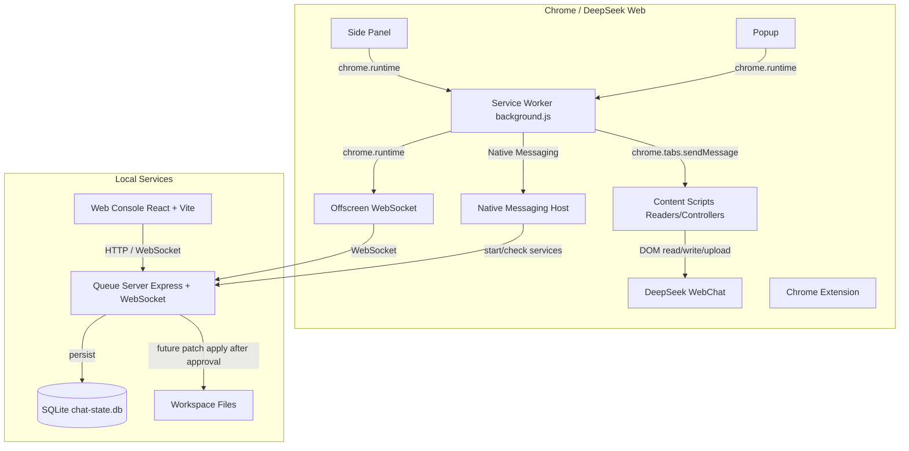
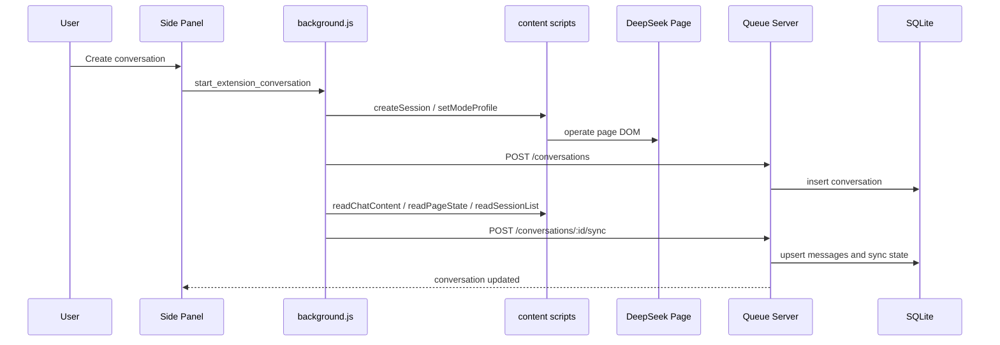

# free-chat-coder 详细设计文档 v0.2

| 文档版本 | 日期 | 说明 |
| :--- | :--- | :--- |
| v0.1 | 2026-04-08 | 初始版本，以自动进化和 `/evolve` 为主线 |
| v0.2 | 2026-04-25 | 按当前代码收敛结果重写主线：扩展管理 DeepSeek 会话、本地任务队列、会话存储、人工审批；移除自动进化设计 |

## 1. 设计定位

### 1.1 当前目标

`free-chat-coder` 的当前目标是构建一个本地运行的 DeepSeek 辅助开发工作台。系统通过 Chrome 扩展接管 DeepSeek Web 会话，通过本地 Queue Server 管理任务、会话记录、动作审批和后续文件交付协议，通过 Web Console 提供可视化管理界面。

核心原则：

- DeepSeek 负责生成建议、回答和结构化动作意图。
- 本地服务负责调度、存储、校验和权限边界。
- Chrome 扩展负责浏览器页面内的输入、附件上传、会话切换和会话读取。
- 所有高风险本地动作必须先进入人工确认或 patch review，不允许 DeepSeek 直接写入项目文件。

### 1.2 明确不再作为主线的能力

以下旧设计已经从当前产品线移除，不应在后续实现中恢复：

- 不恢复 `/evolve` API。
- 不恢复 auto-evolve、自动进化、自动自修复、cron/autopilot 循环。
- 不让 DeepSeek 直接触发写文件、改代码、重启服务。
- 不把旧 auto-evolve 历史任务导入新知识库。
- 不把 `autoEvolve` 作为 provider 路由条件。

如果未来需要“自动应用修改”，也必须改为独立的 patch review 机制：DeepSeek 只能生成补丁提案，本地服务校验后展示给用户，用户确认后才应用。

## 2. 当前实现状态

| 模块 | 当前状态 | 说明 |
| :--- | :--- | :--- |
| Chrome 扩展 | 已有主体 | 包含 background、offscreen、content scripts、side panel、popup、Native Messaging Host |
| Queue Server | 已有主体 | Express + WebSocket，负责任务、会话、审批、provider 调度 |
| Web Console | 已有主体 | React + Vite，展示任务、会话、审批和 API 测试入口 |
| 会话存储 | 已有主体 | SQLite 存储 conversations、messages、browser_actions、tool_calls、sync_states |
| DeepSeek 页面交互 | 已有主体 | 通过 content scripts 读取页面、提交 prompt、上传附件、切换会话 |
| DeepSeek Web 直连 provider | 保留为可选能力 | 当前不是默认主线；默认 provider 是 `extension-dom` |
| 知识库 | 未完整实现 | 需要下一阶段设计 schema、索引和检索协议 |
| 文件交付协议 | 部分能力已具备 | 扩展侧已有附件上传；缺少统一的任务附件/文件包协议 |
| Patch Review | 未完整实现 | 当前只有动作解析、执行器和审批雏形；缺少补丁提案、diff 预览和应用 API |

## 3. 总体架构



### 3.1 运行边界

- 浏览器侧只处理 DeepSeek 页面自动化和扩展 UI，不直接修改本地项目文件。
- Queue Server 是本地事实中心，负责任务状态、会话状态、审批状态和后续知识库/补丁数据。
- Web Console 是人工管理入口，不承载后台自动修改逻辑。
- Native Messaging Host 只负责本地服务启停和状态探测，不承载业务决策。

## 4. 模块设计

### 4.1 Queue Server

目录重点：

```text
queue-server/
|-- index.js                         # Express 入口、健康检查、路由挂载、端口探测
|-- websocket/handler.js             # WebSocket 注册、任务分发、结果回传、广播
|-- routes/tasks.js                  # 任务 API、审批 API
|-- routes/conversations.js          # 会话 API
|-- queue/manager.js                 # 内存任务队列
|-- conversations/store.js           # SQLite 会话读写封装
|-- storage/sqlite.js                # SQLite schema 初始化
|-- providers/                       # provider registry 与 DeepSeek Web provider
|-- actions/                         # 动作解析、执行器、人工确认
|-- custom-handler.js                # 系统提示注入和 DeepSeek 结果动作编排
|-- system-prompt/template.js        # 系统提示模板
```

当前 API：

| 方法 | 路径 | 用途 |
| :--- | :--- | :--- |
| GET | `/health` | 服务健康检查，返回实际端口 |
| GET | `/tasks` | 获取任务列表和下一个 pending 任务 |
| POST | `/tasks` | 创建任务，支持 `options.provider`、`options.conversationId` |
| PATCH | `/tasks/:id` | REST fallback 更新任务状态 |
| GET | `/tasks/confirms` | 获取待审批动作 |
| POST | `/tasks/confirms/test` | 创建本地测试审批项 |
| POST | `/tasks/confirms/:id` | 同意或拒绝审批项 |
| GET | `/conversations` | 获取会话列表 |
| POST | `/conversations` | 创建会话记录 |
| GET | `/conversations/:id` | 获取会话摘要 |
| GET | `/conversations/:id/messages` | 获取会话消息 |
| POST | `/conversations/:id/sync` | 同步 DeepSeek 页面会话到 SQLite |
| DELETE | `/conversations/:id` | 删除会话 |
| POST | `/install-native-host` | 通过后端执行 Native Host 安装脚本 |

当前 WebSocket 消息：

| 方向 | 类型 | 用途 |
| :--- | :--- | :--- |
| client -> server | `register` | 注册 `extension` 或 `web` 客户端 |
| client -> server | `ping` | 心跳 |
| extension -> server | `task_update` | 扩展回传任务结果 |
| extension -> server | `browser_action_result` | 扩展回传浏览器动作结果 |
| server -> extension | `task_assigned` | 分配任务给扩展执行 |
| server -> extension | `execute_action` / `browser_action` | 要求扩展执行页面动作 |
| server -> web | `task_added` / `task_update` | 通知 Web Console 更新任务 |
| server -> web | `confirm_request` / `confirm_resolved` | 通知审批状态 |
| server -> web | `conversation_created` / `conversation_updated` | 通知会话更新 |
| server -> web | `conversation_messages_updated` | 通知会话消息更新 |

Provider 路由：

- 默认 provider：`extension-dom`。
- 可选 provider：`deepseek-web`。
- `extension-dom` 需要扩展在线，任务经 WebSocket 分配到浏览器页面执行。
- `deepseek-web` 在 Queue Server 内执行文本请求，但不是当前默认主线。
- `autoEvolve` 不再影响 provider 选择。

### 4.2 Chrome 扩展

目录重点：

```text
chromevideo/
|-- manifest.json
|-- background.js
|-- offscreen.html
|-- offscreen.js
|-- content.js
|-- sidepanel.html
|-- sidepanel.js
|-- popup.html
|-- popup.js
|-- readers/
|-- controllers/
|-- content-scripts/
|-- host/
|-- utils/
```

主要职责：

- `background.js`：扩展控制中心，负责 offscreen 生命周期、Queue Server 发现、Native Host 通信、DeepSeek tab 管理、会话创建/恢复/同步、任务执行。
- `offscreen.js`：维持到 Queue Server 的 WebSocket 长连接，转发任务和动作消息。
- `content.js`：统一路由页面动作到 readers/controllers。
- `sidepanel.js`：用户面向的 DeepSeek 会话工作台，支持会话列表、创建会话、切换会话、发送消息、上传附件、查看审批。
- `popup.js`：轻量状态面板，负责服务状态、Native Host 安装、打开 Web Console/DeepSeek。
- `readers/*`：读取页面状态、模型状态、会话列表、聊天内容。
- `controllers/*`：提交 prompt、上传附件、截图、切换模式、管理会话。
- `host/*`：Native Messaging Host，用于本地服务启停。

当前不应出现的扩展行为：

- 不发送 `auto_evolve`。
- 不监听 `start_auto_evolve`、`stop_auto_evolve`、`resume_auto_evolve`。
- 不加载 `auto-evolve-monitor.js`。
- 找不到 DOM 选择器时只上报错误或抛错，不自动生成修复任务。

### 4.3 Web Console

当前职责：

- 连接 Queue Server。
- 展示任务队列和任务结果。
- 创建新任务，并可绑定当前会话。
- 展示扩展同步的会话列表和 transcript。
- 展示待审批动作，并允许用户同意或拒绝。
- 提供简单 API 测试入口。

当前不承担：

- 不提供 Evolve 按钮。
- 不调用 `/evolve`。
- 不提供自动进化验证面板。
- 不直接写本地文件。

后续 Web Console 应扩展为：

- Knowledge Base 面板：查看、导入、检索本地知识条目。
- File Delivery 面板：查看任务交付给 DeepSeek 的文件包和附件状态。
- Patch Review 面板：展示 DeepSeek 返回的修改提案、diff、风险和审批按钮。

### 4.4 SQLite 会话存储

当前数据库文件：

```text
queue-server/data/chat-state.db
```

当前表：

| 表 | 用途 |
| :--- | :--- |
| `conversations` | 会话摘要、DeepSeek session id、模式、标题、状态、metadata |
| `messages` | 会话消息，按 conversation + seq 排序，使用 content hash 去重 |
| `browser_actions` | 由 Queue Server 派发给扩展的浏览器动作及结果 |
| `tool_calls` | 预留的工具调用记录 |
| `sync_states` | 会话同步状态、消息数量、页面状态快照 |

下一阶段建议新增：

| 表 | 用途 |
| :--- | :--- |
| `knowledge_items` | 本地知识条目，保存来源、标题、正文、hash、标签 |
| `knowledge_chunks` | 可检索分块，预留 embedding 或关键词索引字段 |
| `file_deliveries` | 发送给 DeepSeek 的文件包、附件、目标会话、状态 |
| `patch_proposals` | DeepSeek 返回的补丁提案、diff、风险、审批状态 |
| `patch_events` | patch 从创建、校验、审批到应用的事件流水 |

## 5. 核心流程

### 5.1 扩展管理 DeepSeek 会话



### 5.2 Web Console 创建任务

```mermaid
sequenceDiagram
    participant WC as Web Console
    participant QS as Queue Server
    participant OFF as Offscreen
    participant BG as background.js
    participant CS as content scripts
    participant DS as DeepSeek Page
    participant DB as SQLite

    WC->>QS: POST /tasks { prompt, options }
    QS->>DB: append user message if conversationId exists
    QS->>OFF: task_assigned
    OFF->>BG: chrome.runtime message
    BG->>CS: submitPrompt
    CS->>DS: input prompt and wait reply
    CS-->>BG: reply
    BG->>OFF: task_update completed
    OFF->>QS: task_update
    QS->>DB: append assistant result
    QS-->>WC: task_update / conversation_updated
```

### 5.3 DeepSeek 结构化动作与人工审批

DeepSeek 可以在回复中输出结构化 action block。Queue Server 解析后按风险分流：

- 低风险只读动作可以直接执行，例如 `read_file`、`list_files`、`get_system_info`。
- 高风险动作必须进入确认，例如 `write_file`、`install_package`、`execute_command`。
- 浏览器页面动作转发给扩展，例如 `switch_mode`、`upload_screenshot`、`new_session`、`switch_session`、`send_message`。

当前风险边界需要收紧：

- `MANUAL_CONFIRM` 默认关闭时，当前代码会自动批准高风险动作；正式使用前应改为默认需要人工确认。
- `write_file` 暂不应作为主线能力暴露给 DeepSeek；下一阶段应改为生成 `patch_proposal`，由用户审查后应用。

### 5.4 文件交付给 DeepSeek

当前已有基础：

- Side Panel 支持从本地选择文件。
- background 将附件传给 content controller。
- content controller 在 DeepSeek 页面执行上传。

缺口：

- Queue Server 尚未统一记录每次文件交付。
- 任务 `options.attachments` 尚未形成稳定协议。
- 未定义文件大小、类型、敏感路径、二进制内容和截断策略。

建议 v0.3 文件交付协议：

```json
{
  "deliveryId": "fd-...",
  "conversationId": "conv-...",
  "taskId": "task-...",
  "files": [
    {
      "path": "src/example.js",
      "name": "example.js",
      "mimeType": "text/javascript",
      "size": 1234,
      "contentRef": "local-cache-or-inline-ref",
      "deliveryMode": "upload|inline|summary"
    }
  ],
  "policy": {
    "maxBytesPerFile": 200000,
    "allowBinary": false,
    "requireUserConfirm": true
  }
}
```

## 6. 后续主线设计

### 6.1 知识库

知识库的职责是保存项目上下文、已确认的设计决策、常见修复经验和用户偏好。它不应该保存废弃的 auto-evolve 运行历史。

建议最小能力：

- 手动导入 markdown、代码片段、会话摘要。
- 按项目、标签、来源、更新时间检索。
- 支持在创建任务时选择知识条目并拼接到 prompt。
- 记录知识条目的来源和可信度。

### 6.2 Patch Review

Patch Review 替代旧自动进化能力。

建议 API：

| 方法 | 路径 | 用途 |
| :--- | :--- | :--- |
| GET | `/patches` | 获取补丁提案列表 |
| POST | `/patches` | 创建补丁提案 |
| GET | `/patches/:id` | 获取补丁详情和 diff |
| POST | `/patches/:id/validate` | 执行语法检查或测试 |
| POST | `/patches/:id/apply` | 用户确认后应用补丁 |
| POST | `/patches/:id/reject` | 拒绝补丁 |

状态机：

```text
draft -> parsed -> validated -> approved -> applied
                      |             |
                      v             v
                    failed       rejected
```

约束：

- DeepSeek 只能创建 `draft`。
- 本地 parser 必须校验路径是否在 workspace 内。
- 应用补丁前必须展示 diff。
- 默认禁止删除文件、移动目录和执行命令，除非用户明确确认。

### 6.3 协议层

下一阶段应把 DeepSeek 输出从“自由文本 + action block”收敛为明确协议：

```json
{
  "type": "assistant_delivery",
  "version": "0.1",
  "summary": "what changed or what is proposed",
  "actions": [],
  "patches": [],
  "knowledgeRefs": [],
  "requiresUserDecision": true
}
```

协议层目标：

- 减少 prompt 漂移。
- 让 Web Console 能稳定展示结果。
- 让本地服务可以校验风险。
- 方便后续给 opencode、Codex 或其他执行器交接。

## 7. 验收标准

当前 v0.2 收敛验收：

- 代码中非文档区域不再出现旧自动进化运行时入口。
- Web Console 不调用 `/evolve`。
- Chrome 扩展不加载 `auto-evolve-monitor.js`。
- Popup 不显示自动进化面板。
- Queue Server 不挂载 `/evolve`。
- `node queue-server/test-deepseek-provider.js` 通过。
- `web-console` 能成功构建。

后续 v0.3 功能验收：

- 扩展可以创建、切换、同步 DeepSeek 会话。
- Queue Server 可以持久化会话消息并去重。
- Web Console 可以查看会话 transcript。
- 文件交付记录可追踪。
- DeepSeek 返回的修改只能形成 patch proposal，不能直接写文件。
- 高风险动作默认需要人工确认。

## 8. 风险与处理

| 风险 | 影响 | 处理 |
| :--- | :--- | :--- |
| DeepSeek 页面 DOM 变化 | 扩展提交、读取、上传失败 | 将 DOM 失败作为诊断错误处理；不要触发自动修复 |
| 高风险动作默认自动通过 | 可能误改文件或执行命令 | 正式使用前将 `MANUAL_CONFIRM` 默认路径改为强制人工确认 |
| provider 主线混乱 | 任务可能绕过扩展或依赖过期实验能力 | 默认保持 `extension-dom`，`deepseek-web` 仅作为显式 provider |
| 会话数据膨胀 | SQLite 体积增长、检索变慢 | 增加归档、分页、摘要和知识库分层 |
| 文件交付泄露敏感信息 | 误把密钥或私有文件发送给 DeepSeek | 文件交付前做路径白名单、大小限制、敏感模式扫描和用户确认 |
| patch 应用越权 | 修改 workspace 外文件或删除重要内容 | patch parser 必须限制路径，应用前展示 diff 并要求确认 |

## 9. 开发启动与检查

```powershell
# 后端
cd queue-server
npm install
npm run dev

# 前端
cd web-console
npm install
npm run dev

# 环境检查
node validate-environment.js
node validate-environment.js --profile .browser-profile
```

推荐验证：

```powershell
node -c queue-server\index.js
node -c queue-server\websocket\handler.js
node -c chromevideo\background.js
node -c chromevideo\offscreen.js
node -c chromevideo\popup.js
node queue-server\test-deepseek-provider.js

cd web-console
npm run build
```

浏览器侧人工验证：

- 加载 `chromevideo/` 扩展。
- 打开 DeepSeek 页面，确认 Side Panel 可打开。
- 创建会话并发送一条消息。
- 确认 Queue Server 中出现 conversation 和 messages。
- 打开 Web Console，确认任务、会话、审批区域可正常刷新。

