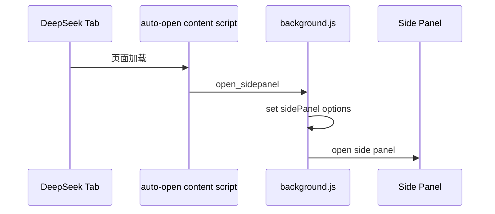
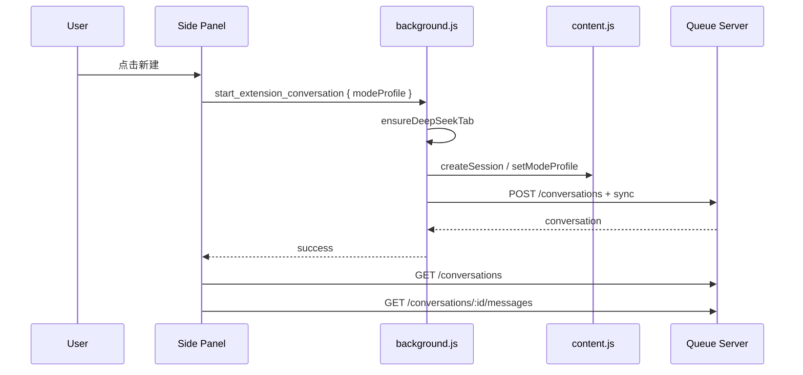
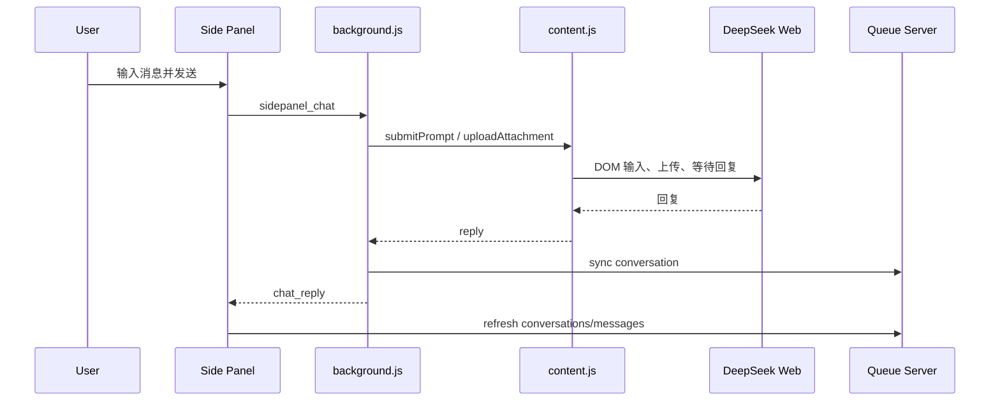

# DeepSeek Agent Bridge 扩展前端设计文档

更新日期：2026-04-25

## 1. 文档定位

本文档初始化 `chromevideo/` Chrome 扩展的前端设计，覆盖扩展中用户可见界面、无界面前端通道、页面注入脚本和它们与 Queue Server / Web Console / DeepSeek Web 的交互边界。

当前文档以现有实现为准，重点覆盖：

- `chromevideo/sidepanel.html` / `sidepanel.js`：扩展主工作台。
- `chromevideo/popup.html` / `popup.js`：浏览器工具栏弹窗。
- `chromevideo/utils/service-workbench.js` / `service-workbench.css`：共享服务诊断与启停面板。
- `chromevideo/offscreen.html` / `offscreen.js`：扩展侧 WebSocket 长连接。
- `chromevideo/content.js`、`readers/`、`controllers/`：DeepSeek 页面内能力路由。
- `chromevideo/background.js`：扩展前端与本地服务、DeepSeek 页面之间的编排层。

扩展前端的定位是：在 DeepSeek Web 页面附近提供可控的聊天、会话、附件、审批和诊断入口。它不直接修改本地项目文件，也不承载后台业务决策。

## 2. 当前实现概览

### 2.1 Manifest 能力

当前扩展为 Manifest V3，名称为 `DeepSeek Agent Bridge`，版本 `0.2.0`。

关键权限：

| 权限 | 用途 |
| :--- | :--- |
| `sidePanel` | 展示主工作台 |
| `offscreen` | 维持 WebSocket 长连接页面 |
| `nativeMessaging` | 与本地 Native Host 通信，启停服务和读取状态 |
| `tabs` / `activeTab` / `scripting` / `webNavigation` | 管理 DeepSeek tab、注入和页面通信 |
| `storage` | 保存 Service Workbench 事件等轻量状态 |
| `alarms` | MV3 service worker keep-alive 辅助 |

Host permissions：

```text
https://chat.deepseek.com/*
http://localhost/*
```

### 2.2 前端组成

```text
chromevideo/
|-- sidepanel.html / sidepanel.js       # 主工作台 UI
|-- popup.html / popup.js               # 工具栏弹窗 UI
|-- offscreen.html / offscreen.js       # 无界面 WebSocket 通道
|-- content.js                          # DeepSeek 页面动作路由
|-- content-scripts/auto-open-sidepanel.js
|-- readers/                            # 页面状态、模型、会话、聊天读取
|-- controllers/                        # 模式、prompt、截图、会话、上传控制
|-- utils/service-workbench.*           # 共享服务诊断组件
|-- utils/queue-config.js               # Queue Server 自动发现
`-- background.js                       # 扩展后台编排
```

### 2.3 当前能力

- DeepSeek 页面打开后自动启用 Side Panel。
- Side Panel 可创建、切换、删除扩展管理的会话。
- Side Panel 可选择快速/专家模式，并同步 DeepSeek 当前模式。
- Side Panel 可发送聊天消息到 DeepSeek，并同步会话 transcript 到 Queue Server。
- Side Panel 可添加附件，当前支持多种文本、代码、文档和图片格式。
- Side Panel 可展示待审批动作，并同意或拒绝。
- Side Panel / Popup 都可查看本地服务状态和 Native Host 状态。
- Popup 可安装 Native Host、打开 Web Console、打开 DeepSeek、刷新诊断。
- Offscreen 维持扩展到 Queue Server 的 WebSocket 通道，接收任务、审批和浏览器动作。
- Content Script 将 background 发来的动作路由给页面 readers/controllers。

## 3. 设计目标

### 3.1 主目标

扩展前端应完成三件事：

1. 让用户在 DeepSeek 页面旁边完成受控的人机协作。
2. 让扩展稳定接入 Queue Server，接收任务、审批和浏览器动作。
3. 让本地服务诊断和修复入口足够清晰，减少启动失败时的排障成本。

### 3.2 非目标

扩展前端不应承担：

- 本地项目文件写入。
- 高风险动作的最终授权判断。
- Queue Server provider 路由策略。
- Patch 应用逻辑。
- 自动进化、自修复、cron/autopilot 循环。

如果 DeepSeek 返回了结构化动作，扩展前端只负责展示、转发或执行浏览器页面动作；本地高风险动作必须由 Queue Server 审批链路控制。

## 4. 信息架构

### 4.1 Side Panel 主工作台

Side Panel 是扩展最重要的前端界面，结构如下：

```text
Side Panel
|-- Top Bar
|   |-- SOLO Coder 标识
|   |-- 连接状态
|   `-- 设置按钮
|-- Pending Approvals Strip
|-- Conversation Strip
|   |-- 快速/专家模式切换
|   |-- 会话数量
|   |-- 新建会话
|   `-- 横向会话 chip 列表
|-- Log Area
|   |-- 欢迎提示
|   |-- user / ai / system / task 消息气泡
|   `-- typing indicator
|-- Input Area
|   |-- 附件预览
|   |-- 多行输入框
|   |-- 附件按钮
|   `-- 发送按钮
`-- Settings View
    |-- Service Workbench
    |-- 错误提示
    `-- Native Host 安装提示
```

#### Top Bar

职责：

- 展示扩展品牌。
- 展示 Native Host / 本地服务连接状态。
- 进入设置视图。

当前连接文案由 `updateConnectionUI` 控制：

- `Connected`
- `Disconnected`
- 初始为 `Connecting...`

#### Pending Approvals Strip

职责：

- 在有待审批动作时显示。
- 展示 action、risk level、confirm id、task id、createdAt、params。
- 支持 Reject / Approve。

数据来源：

- 初始和轮询：`GET /tasks/confirms`。
- 增量：background 转发的 `confirm_request` / `confirm_resolved`。
- 操作：`POST /tasks/confirms/:id { approved }`。

设计要求：

- 风险等级必须显眼。
- params 使用可滚动的 JSON 预览。
- 审批按钮提交中要禁用，避免重复操作。
- 审批最终含义由 Queue Server 决定，前端不本地执行高风险动作。

#### Conversation Strip

职责：

- 展示扩展创建或监控的会话。
- 切换当前会话。
- 新建会话。
- 删除会话监控。
- 切换快速/专家模式。

数据来源：

- `GET /conversations?origin=extension&limit=50`。
- `GET /conversations/:id/messages`。
- `DELETE /conversations/:id`。
- background 消息：`start_extension_conversation`、`activate_conversation`。

会话 chip 展示：

- title。
- 最近消息预览或 session id。
- 更新时间。
- active 状态。

#### Log Area

Log Area 是扩展内的 transcript 和事件流区域。

消息类型：

| 类型 | 样式 | 用途 |
| :--- | :--- | :--- |
| `user` | 右侧高亮气泡 | 用户发送的 prompt |
| `ai` | 左侧响应气泡 | DeepSeek 回复，可拆分思考过程和正式回答 |
| `system` | 居中虚线提示 | 连接、错误、模式切换、服务操作等系统事件 |
| `task` | 任务结果气泡 | Queue Server 任务完成或失败结果 |

当前渲染能力：

- 支持简易 Markdown。
- 支持代码块。
- 支持行内代码。
- AI 思考过程默认折叠。
- 用户滚动离开底部后暂停自动滚动，回到底部后恢复。

#### Input Area

职责：

- 输入聊天消息。
- `Enter` 发送，`Shift+Enter` 换行。
- 自动调整输入框高度，最大约 120px。
- 添加附件并在发送前预览。

附件限制：

- 单文件最大 20MB。
- 总附件最大 50MB。
- 支持 `.txt/.md/.json/.js/.ts/.py/.html/.css/.csv/.xml/.yaml/.yml/.sh/.pdf/.doc/.docx/.png/.jpg/.jpeg/.gif/.svg`。

发送消息结构：

```json
{
  "type": "sidepanel_chat",
  "prompt": "用户输入",
  "conversationId": "当前会话 ID 或 null",
  "modeProfile": "quick 或 expert",
  "attachments": []
}
```

### 4.2 Settings View

Settings View 通过设置按钮进入，核心是共享 `Service Workbench`。

职责：

- 展示 Queue Server、Web Console、Native Host 状态。
- 启动/停止 Queue Server。
- 启动/停止 Web Console。
- 打开 Web Console。
- 打开 DeepSeek。
- 刷新服务诊断。
- 展示自动拉起状态。
- 展示 Native Host 安装/连接错误。

注意：Settings View 是诊断和服务控制界面，不是任务执行界面。

### 4.3 Popup

Popup 是浏览器工具栏里的轻量入口，宽度约 320px，结构如下：

```text
Popup
|-- 标题 SOLO Coder Servers
|-- Service Workbench
|-- error message
`-- setup hint / Install Native Host
```

Popup 复用 `Service Workbench`，并与 Native Host 建立短生命周期连接：

- 打开 popup 时连接 Native Host。
- 收到 `status` 后更新 Queue / Web 状态。
- 断开时展示安装提示。
- 点击安装按钮触发 background 的 `install_native_host`。

Popup 适合：

- 快速确认服务是否启动。
- 手动启动/停止本地服务。
- 安装 Native Host。
- 打开 Web Console 或 DeepSeek。

Popup 不适合：

- 长时间聊天。
- 会话管理。
- 审批复杂动作。

### 4.4 Service Workbench

`utils/service-workbench.js` 是 Side Panel 与 Popup 共享的服务诊断组件。

核心展示：

- Queue Server 状态。
- Web Console 状态。
- Native Host 安装状态。
- 自动拉起诊断 banner。
- 最近服务事件。

核心操作：

| 操作 | 回调 |
| :--- | :--- |
| Start Queue | `onCommand("start_queue")` |
| Stop Queue | `onCommand("stop_queue")` |
| Start Web | `onCommand("start_web")` |
| Stop Web | `onCommand("stop_web")` |
| Open Web | `onOpenWeb()` |
| Open DeepSeek | `onOpenDeepSeek()` |
| Refresh | `onRefresh()` |
| 模拟 DOM 错误 | `onTestDomError()` |

事件存储：

- 使用 `chrome.storage.local`。
- key 为 `serviceWorkbenchEvents`。
- 最多保留 8 条事件。

风险提示：

- 当前组件中仍有“模拟 DOM 错误”的诊断入口，说明文案带有历史 auto-evolve 痕迹。后续应改名为“记录 DOM 诊断样本”，避免与已废弃的自动进化主线混淆。

## 5. 无界面前端通道

### 5.1 Offscreen WebSocket

`offscreen.js` 是扩展侧接入 Queue Server 的长连接通道。

启动后流程：

1. 通过 `queueConfig.discoverQueueServer()` 自动发现 Queue Server。
2. 连接 `ws://localhost:<port>`。
3. WebSocket 打开后发送：

```json
{
  "type": "register",
  "clientType": "extension"
}
```

4. 每 30 秒发送 `ping`。
5. 连接断开后清空端口缓存，5 秒后强制重新发现并重连。

接收 Queue Server 消息：

| 消息 | 处理 |
| :--- | :--- |
| `pong` | 忽略 |
| `reload_extension` | 通知 background 重载扩展 |
| `confirm_request` / `confirm_resolved` | 转发给 background |
| `execute_action` / `browser_action` | 转发给 background |
| `task_assigned` | 记录当前任务 ID，转发给 background |

接收 background 消息：

| 消息 | 处理 |
| :--- | :--- |
| `task_update` | 转发给 Queue Server |
| `browser_action_result_local` | 转换为 `browser_action_result` 发给 Queue Server |
| `get_extension_status` | 返回 WS readyState、url、heartbeat、当前任务、uptime |

### 5.2 Queue Server 自动发现

扩展使用 `utils/queue-config.js` 自动发现本地服务：

```text
localhost:8080
localhost:8082
localhost:8083
localhost:8084
localhost:8085
localhost:8086
localhost:8087
localhost:8088
localhost:8089
localhost:8090
```

校验条件：

- `/health` 响应成功。
- `status === "ok"`。
- `service === "free-chat-coder-queue-server"`。

该逻辑应与 Web Console 的服务发现保持一致，差异仅是 Web Console 当前使用 `127.0.0.1`，扩展使用 `localhost`。

## 6. Content Script 与页面动作

`content.js` 是 DeepSeek 页面内动作路由器。background 使用 `chrome.tabs.sendMessage(tabId, { action, params })` 调用页面能力。

当前支持动作：

| action | 实际模块 | 用途 |
| :--- | :--- | :--- |
| `submitPrompt` | `PromptController` | 输入 prompt 并等待回复 |
| `setModelMode` | `ModeController` | 设置模型模式 |
| `setModeProfile` | `ModeController` | 设置 quick/expert profile |
| `readModeProfile` | `ModeController` | 读取当前 profile |
| `createSession` | `SessionController` | 创建 DeepSeek 会话 |
| `switchSession` | `SessionController` | 切换 DeepSeek 会话 |
| `readSessionList` | `SessionReader` | 读取会话列表 |
| `readChatContent` | `ChatReader` | 读取聊天内容 |
| `readLatestReply` | `ChatReader` | 读取最新回复 |
| `readModelState` | `ModelReader` | 读取模型状态 |
| `readPageState` | `PageStateReader` | 读取页面状态 |
| `uploadAttachment` | `UploadController` | 上传附件 |
| `captureScreenshot` | `ScreenshotController` | 截图 |
| `getConversation` | legacy wrapper | 兼容旧会话读取 |
| `ping` | content.js | 探活 |

错误处理：

- 未知 action 抛出 `UnknownAction`。
- action 失败时通过 `content_script_error` 上报 background。
- response 返回 `{ success: false, error }`。

设计边界：

- content script 只操作 DeepSeek 页面 DOM。
- content script 不调用本地文件系统。
- 页面 DOM 变化导致失败时，应上报诊断信息，不自动创建修复任务。

## 7. Background 编排边界

`background.js` 是扩展前端的编排层，不是 UI，但它决定扩展前端消息如何流转。

面向 Side Panel / Popup 的主要消息：

| 消息 | 来源 | 作用 |
| :--- | :--- | :--- |
| `start_extension_conversation` | Side Panel | 打开/确保 DeepSeek tab，创建托管会话并同步 |
| `activate_conversation` | Side Panel | 切换托管会话 |
| `sidepanel_chat` | Side Panel | 提交聊天、附件和当前 profile |
| `get_service_bootstrap_status` | Side Panel / Popup | 查询服务自动拉起状态 |
| `refresh_service_bootstrap_status` | Side Panel / Popup | 手动刷新并尝试拉起服务 |
| `check_native_host` | UI | 检查 Native Host 可用性 |
| `install_native_host` | Popup | 安装 Native Host |
| `get_extension_status` | UI / 诊断 | 查询 background 与 offscreen 状态 |
| `upload_attachment` | UI / 旧接口 | 上传附件到 DeepSeek |
| `open_sidepanel` | content script | 打开 Side Panel |

面向 UI 的广播：

| 消息 | 用途 |
| :--- | :--- |
| `heartbeat_status` | 更新 Service Workbench 状态 |
| `service_bootstrap_status` | 更新自动拉起诊断 |
| `chat_reply` | Side Panel 收到聊天完成或错误 |
| `task_update` | Side Panel 展示任务完成/失败 |
| `confirm_request` / `confirm_resolved` | Side Panel 更新审批条 |

## 8. 关键流程

### 8.1 打开 DeepSeek 后自动启用 Side Panel



### 8.2 新建扩展会话



### 8.3 Side Panel 聊天



### 8.4 Queue Server 分配任务给扩展

```mermaid
sequenceDiagram
    participant QS as Queue Server
    participant OFF as offscreen.js
    participant BG as background.js
    participant CS as content.js
    participant DS as DeepSeek Web

    QS-->>OFF: task_assigned
    OFF-->>BG: task_assigned
    BG->>CS: submitPrompt
    CS->>DS: 执行页面动作
    DS-->>CS: 回复或错误
    BG-->>OFF: task_update
    OFF-->>QS: task_update
```

### 8.5 审批动作

```mermaid
sequenceDiagram
    participant QS as Queue Server
    participant OFF as offscreen.js
    participant BG as background.js
    participant SP as Side Panel
    participant User as User

    QS-->>OFF: confirm_request
    OFF-->>BG: confirm_request
    BG-->>SP: confirm_request
    SP->>User: 展示风险和参数
    User->>SP: Approve / Reject
    SP->>QS: POST /tasks/confirms/:id
    QS-->>OFF: confirm_resolved
    OFF-->>BG: confirm_resolved
    BG-->>SP: confirm_resolved
```

## 9. 视觉与交互规范

### 9.1 Side Panel

Side Panel 当前采用深色工作台风格：

- 背景：深蓝黑。
- 状态色：green / red / yellow / blue。
- 主强调色：indigo。
- 卡片与消息使用半透明背景和细边框。

设计要求：

- 保持窄宽度下的信息密度，避免大块装饰。
- 长 prompt、长 ID、长 JSON 必须可换行或滚动。
- 会话 chip 横向滚动，不应撑破侧边栏宽度。
- 审批条必须占据明显位置，但不能遮挡输入区。
- 输入区固定在底部，log 区域独立滚动。

### 9.2 Popup

Popup 当前是浅量服务控制界面：

- 宽度 320px。
- 内嵌 Service Workbench。
- 展示 Native Host 安装提示。
- 操作应尽量短路径，不承载复杂任务流。

设计要求：

- 所有服务启停按钮必须反馈状态。
- 安装 Native Host 后应自动尝试重连。
- Native Host 不可用时，明确展示手动安装路径。

### 9.3 Service Workbench

Service Workbench 需要在 Side Panel 深色背景和 Popup 浅色背景中都可读。后续修改样式时要同时验证两处。

应保持：

- 三个服务状态 pill：Queue / Web / Host。
- Queue Server 与 Web Console 的独立卡片。
- Quick Actions 卡片。
- 自动拉起诊断 banner。
- 最近事件。

## 10. 安全与权限边界

扩展前端必须保持以下边界：

- Side Panel 只提交聊天、附件、会话和审批意图。
- Popup 只做服务状态、启停和安装入口。
- Offscreen 只做消息转发和连接状态维护。
- Content Script 只操作 DeepSeek Web 页面。
- Background 负责编排，但不绕过 Queue Server 的审批策略。
- Native Host 只处理本地服务启停和状态，不承载业务决策。

高风险本地动作必须走 Queue Server confirm 或后续 Patch Review 流程。

## 11. 当前问题与改进建议

### P0：清理历史命名和文案

- `chromevideo/` 目录名仍带历史含义，短期可保留，但文档和 UI 应统一称为 `DeepSeek Agent Bridge`。
- `Service Workbench` 中“模拟 DOM 错误”的事件说明仍提到 auto-evolve，应改为“记录 DOM 诊断样本”。
- 部分 UI 文案和注释在终端显示有编码错位，需要确认文件统一 UTF-8。

验收标准：

- UI 不再出现自动进化相关主线暗示。
- 用户能理解 DOM 诊断只是采样，不会触发自修复任务。

### P0：补齐错误状态可见性

- Side Panel 发送失败应区分 Native Host、DeepSeek tab、content script、Queue Server 同步失败。
- 会话加载失败应在会话区域显示，而不只追加系统消息。
- 附件上传失败应标记具体文件。
- Offscreen 断线状态应能在 Service Workbench 或扩展状态中显示。

验收标准：

- 用户不打开 DevTools 也能定位失败环节。

### P1：拆分 Side Panel 前端代码

当前 `sidepanel.js` 与 `sidepanel.html` 较大，建议按职责拆分：

```text
chromevideo/sidepanel/
|-- state.js
|-- api.js
|-- conversations.js
|-- approvals.js
|-- chat.js
|-- attachments.js
|-- settings.js
|-- render-message.js
`-- bootstrap.js
```

拆分原则：

- 先抽纯函数：escape、markdown、时间格式化、附件大小格式化。
- 再抽 Queue Server API 封装。
- 最后拆 UI 区域控制器。
- 保持 message type 和 DOM id 兼容。

### P1：会话体验增强

- 会话 chip 增加搜索或过滤。
- 删除会话前展示会话标题和影响范围。
- 当前会话与 DeepSeek 页面真实会话不同步时给出提示。
- 新建会话时展示明确的 loading 状态。

### P1：审批体验增强

- 对 `params` 做结构化字段展示。
- 显示审批过期时间。
- 增加查看关联任务入口。
- 增加审批历史入口，数据来源应由 Queue Server 持久化提供。

### P2：附件协议收敛

- 当前 Side Panel 将附件转为 base64 放在 `sidepanel_chat` 消息中。
- 后续应与 Queue Server 的任务附件 / 文件交付协议对齐。
- 大文件应避免长期驻留在扩展内存中。

### P2：统一扩展与 Web Console 的状态模型

- Queue Server 端口发现策略保持一致。
- 审批、会话、任务状态字段保持一致。
- Web Console 与 Side Panel 对同一 confirm/task/conversation 的展示语义保持一致。

## 12. 验证清单

修改扩展前端后，至少验证：

```bash
node -c chromevideo/background.js
node -c chromevideo/offscreen.js
node -c chromevideo/sidepanel.js
node -c chromevideo/popup.js
node -c chromevideo/content.js
```

手动验证建议：

- 打开 `https://chat.deepseek.com/` 后 Side Panel 可打开。
- Side Panel 能显示连接状态。
- Settings View 能展示 Queue / Web / Host 状态。
- Popup 能连接 Native Host 并刷新状态。
- Queue Server 未启动时能显示明确错误或启动入口。
- 新建会话成功后会话 chip 出现。
- 切换 quick/expert 模式能同步到 DeepSeek 页面。
- 发送消息后能收到 `chat_reply` 并刷新 transcript。
- 添加和移除附件正常。
- 有 pending confirm 时审批条出现，Approve / Reject 后消失。
- Offscreen 断开 Queue Server 后能重连。

## 13. 文件索引

| 文件 | 说明 |
| :--- | :--- |
| `chromevideo/manifest.json` | 扩展权限、content scripts、side panel 配置 |
| `chromevideo/sidepanel.html` | Side Panel 结构与样式 |
| `chromevideo/sidepanel.js` | Side Panel 状态、会话、聊天、附件、审批和设置逻辑 |
| `chromevideo/popup.html` | Popup 结构与局部样式 |
| `chromevideo/popup.js` | Popup Native Host 连接和 Service Workbench 绑定 |
| `chromevideo/utils/service-workbench.js` | 共享服务状态、启停、诊断组件 |
| `chromevideo/utils/service-workbench.css` | Service Workbench 样式 |
| `chromevideo/utils/queue-config.js` | Queue Server 端口发现 |
| `chromevideo/offscreen.html` | Offscreen 页面载体 |
| `chromevideo/offscreen.js` | 扩展 WebSocket 长连接 |
| `chromevideo/background.js` | 扩展后台编排 |
| `chromevideo/content.js` | DeepSeek 页面动作路由 |
| `chromevideo/readers/*` | DeepSeek 页面读取能力 |
| `chromevideo/controllers/*` | DeepSeek 页面控制能力 |

