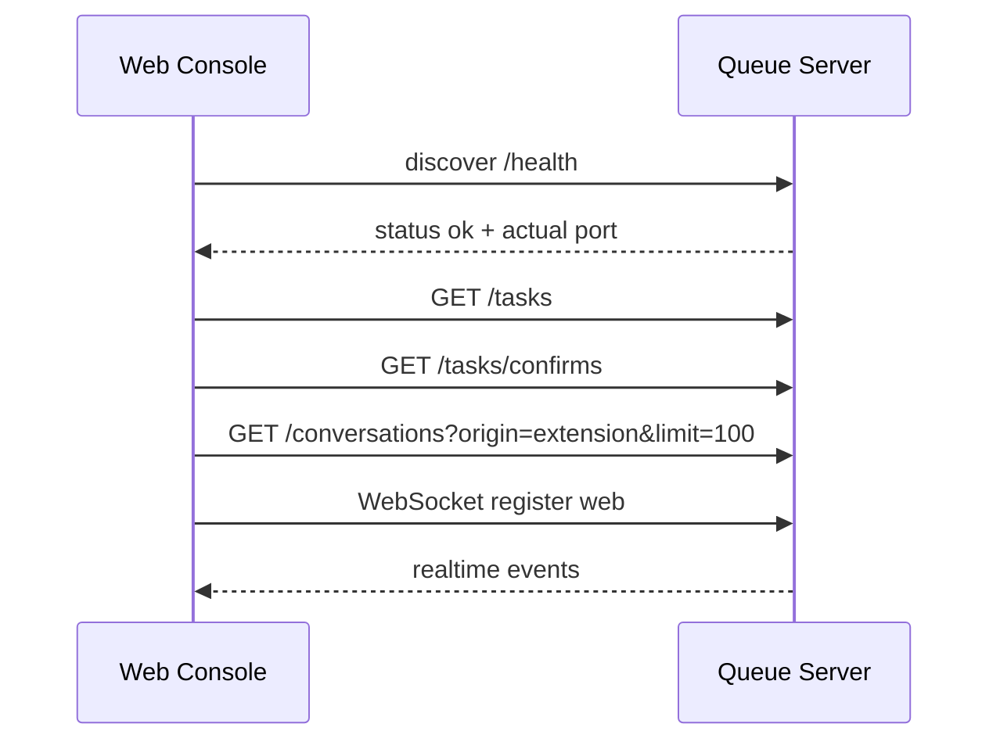
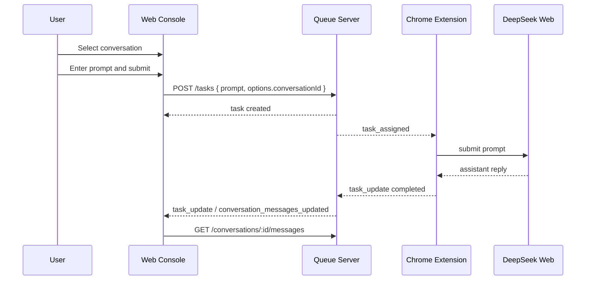
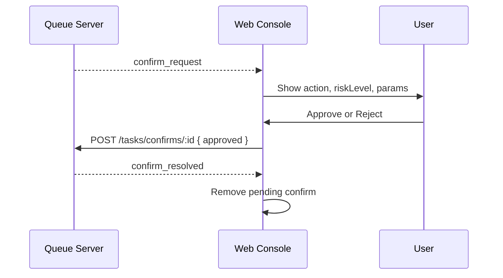

# free-chat-coder 前端控制台设计文档

更新日期：2026-04-25

## 1. 文档定位

本文档初始化 `web-console/` 前端控制台的产品与技术设计，描述当前实现、界面结构、数据契约、交互流程和后续演进边界。当前文档以现有代码为准，重点覆盖：

- `web-console/src/App.tsx`：控制台主界面、状态管理、HTTP/WebSocket 交互。
- `web-console/src/queueServer.ts`：Queue Server 自动发现与请求封装。
- `web-console/src/index.css`：全局样式基础。
- `doc/api-contract.md` 和 `doc/design-doc.md`：后端 API、模块边界和系统主线。

前端控制台的定位是本地 AI 协作工作台的人机管理入口，不承担后台自动执行策略，不直接修改本地项目文件。

## 2. 当前前端概览

### 2.1 技术栈

| 项目 | 当前选择 | 说明 |
| :--- | :--- | :--- |
| 构建工具 | Vite | `web-console/package.json` 中通过 `vite` 启动、构建和预览 |
| UI 框架 | React 19 + TypeScript | 当前主要实现集中在 `src/App.tsx` |
| 样式 | Tailwind CSS v4 | 通过 `@tailwindcss/vite` 插件与 `@import "tailwindcss"` 接入 |
| 图标 | `lucide-react` | 用于状态、刷新、发送、审批等控制 |
| 编辑器 | `@monaco-editor/react` | 用于新任务输入框，语言模式为 Markdown |
| 后端连接 | Fetch + WebSocket | HTTP 拉取全量/操作，WebSocket 接收增量事件 |

### 2.2 当前页面能力

控制台已经具备以下可用能力：

- 自动发现 Queue Server 实际端口，并展示连接状态。
- 展示任务统计：总任务、处理中、待处理、失败、会话数。
- 浏览扩展同步的 DeepSeek 会话列表。
- 查看当前会话 transcript。
- 创建新任务，并可绑定当前会话。
- 展示待审批动作，支持同意或拒绝。
- 提供 Queue Server API Tester，用于直接调试 HTTP 接口。
- 展示任务队列、任务状态、结果和错误预览。

### 2.3 当前限制

- 控制台仍是单文件主应用，视图、状态和请求逻辑耦合在 `App.tsx` 中。
- 任务状态仅覆盖 `pending`、`processing`、`completed`、`failed`，尚未落地 `waiting_approval` 等更细状态。
- 审批记录当前展示内存中的 pending confirm，尚未形成完整的持久审计视图。
- API Tester 是开发诊断入口，尚未加入保存请求、历史记录、环境变量等能力。
- Patch Review、Knowledge Base、File Delivery 仍是后续模块，当前前端只应预留入口，不应伪造已实现能力。

## 3. 设计目标

### 3.1 核心目标

前端控制台应让用户清楚地掌握本地 AI 协作闭环：

1. Queue Server 是否可用。
2. Chrome 扩展和 DeepSeek 会话是否同步。
3. 当前有哪些任务、处于什么状态、产出了什么结果。
4. 哪些动作需要人工审批，审批前能看到风险和参数。
5. 出错时能定位是连接、任务、会话、审批还是 API 层问题。

### 3.2 非目标

当前前端控制台不做以下事情：

- 不恢复 `/evolve`、auto-evolve、自修复或 cron/autopilot 流程。
- 不让 DeepSeek 直接写入项目文件。
- 不绕过 Queue Server 直接执行本地高风险操作。
- 不在前端保存敏感凭据或 DeepSeek 登录态。
- 不把尚未实现的 Patch Review / Knowledge Base 表现为可用生产能力。

## 4. 信息架构

当前页面采用工作台式布局，而不是营销式首页。整体结构如下：

```text
Header
|-- 品牌/标题
|-- Queue Server 端口
|-- WebSocket 状态
`-- Refresh

Stats
|-- Total tasks
|-- Processing
|-- Pending
|-- Failed
`-- Conversations

Main Workspace
|-- Left Aside
|   |-- Conversations
|   `-- Pending Approvals
|-- Center
|   |-- Transcript
|   `-- New Task
`-- Right Aside
    `-- API Tester

Task Queue
`-- 任务列表、状态、结果/错误预览
```

### 4.1 Header

Header 负责展示全局运行状态：

- Queue Server 实际端口：由 `/health` 自动发现。
- WebSocket 状态：`WS online` 或 `WS offline`。
- Refresh：手动刷新任务、审批和会话列表。

设计要求：

- 连接状态必须一眼可见。
- 端口发现失败时不能阻塞页面渲染，应保持可恢复状态。
- Refresh 只做数据刷新，不重置用户正在输入的新任务内容。

### 4.2 Stats

Stats 是对当前工作台状态的轻量总览：

- `Total tasks`：任务总数。
- `Processing`：处理中任务数。
- `Pending`：等待分配或执行任务数。
- `Failed`：失败任务数。
- `Conversations`：当前扩展来源会话数。

后续可以增加 `Waiting approval`，但应先与后端任务状态机对齐。

### 4.3 Conversations

会话列表展示扩展同步到 Queue Server 的 DeepSeek 会话摘要：

- 标题或兜底 ID。
- DeepSeek session id 或本地 conversation id。
- mode profile。
- 最近消息预览。
- 消息数量和更新时间。

用户选择会话后：

- 中间 Transcript 切换到该会话消息。
- New Task 自动绑定该会话。
- 新任务创建后，prompt 和后续结果应进入该会话上下文。

### 4.4 Pending Approvals

审批面板展示当前待处理 confirm：

- action 名称。
- confirm id。
- risk level。
- params JSON。
- 创建时间。
- Reject / Approve 操作。

设计边界：

- 前端只表达用户意图，审批结果必须提交给 Queue Server。
- 高风险动作的含义、参数校验和实际执行边界由 Queue Server 负责。
- 当前 pending confirm 不等于完整审计记录，后续应增加历史审批视图。

### 4.5 Transcript

Transcript 展示当前会话已同步消息：

- role。
- seq。
- createdAt。
- content。
- source。

空状态分为两类：

- 未选择会话：提示从左侧选择。
- 已选择但无消息：提示该会话尚无同步消息。

后续建议：

- 增加消息搜索。
- 增加按 source 或 role 过滤。
- 对长消息提供折叠、复制和跳转到关联任务。

### 4.6 New Task

新任务输入区使用 Monaco Editor，当前以 Markdown 输入为主。提交行为：

- prompt 为空时禁用提交。
- 有当前会话时，提交 `options.conversationId`。
- 没有当前会话时，创建独立任务。
- 提交成功后清空输入；若绑定会话，则刷新会话消息和会话摘要。

设计要求：

- 不在前端拼接系统提示词。
- 不在前端决定 provider 路由，除非后续增加明确的 provider 选择控件并与后端契约对齐。
- 错误应在界面内反馈，当前仅 `console.error`，需要后续补齐。

### 4.7 API Tester

API Tester 是开发和诊断入口，当前支持：

- 预设请求：Health、Tasks、Conversations、Create Task。
- 自定义 HTTP method。
- 自定义 path。
- 自定义 headers JSON。
- 自定义 request body。
- 展示响应状态码、耗时、响应头和响应体。

设计边界：

- API Tester 面向本地开发者，不是普通任务流主入口。
- 默认只请求自动发现的 Queue Server。
- 需要避免把危险接口伪装成常规操作按钮。

### 4.8 Task Queue

任务队列展示最新任务在前：

- prompt。
- task id。
- conversation id。
- status。
- createdAt。
- result 或 error 预览。

后续建议：

- 增加任务详情抽屉。
- 增加按状态过滤。
- 增加失败原因分类和重试入口。
- 与 Transcript 双向关联：从任务跳到关联消息，从消息跳到关联任务。

## 5. 数据与状态模型

### 5.1 前端核心状态

| 状态 | 类型 | 来源 | 用途 |
| :--- | :--- | :--- | :--- |
| `tasks` | `Task[]` | `GET /tasks`、WS `task_added/task_update` | 任务统计与任务队列 |
| `pendingConfirms` | `PendingConfirm[]` | `GET /tasks/confirms`、WS `confirm_request/confirm_resolved` | 审批面板 |
| `conversations` | `Conversation[]` | `GET /conversations`、WS `conversation_created/conversation_updated` | 会话列表 |
| `activeConversationId` | `string` | 用户选择或刷新兜底 | 当前 transcript 和任务绑定 |
| `conversationMessages` | `ConversationMessage[]` | `GET /conversations/:id/messages`、WS 消息更新后刷新 | transcript |
| `prompt` | `string` | Monaco Editor | 新任务输入 |
| `isConnected` | `boolean` | WebSocket lifecycle | 全局连接状态 |
| `queuePort` | `number \| null` | Queue Server 发现 | 展示当前后端端口 |
| `apiTest*` | 多个字段 | API Tester 表单 | 诊断请求 |

### 5.2 派生状态

- `sortedConversations`：按 `updatedAt` 倒序。
- `activeConversation`：从排序后的会话中匹配当前 ID。
- `sortedTasks`：按 `createdAt` 倒序。
- `taskStats`：从 `tasks` 聚合任务数量。

### 5.3 增量合并策略

当前前端使用 upsert 函数处理 WebSocket 增量事件：

- `upsertTask`：按 `task.id` 新增或替换。
- `upsertConfirm`：按 `confirm.confirmId` 新增或替换。
- `upsertConversation`：按 `conversation.id` 新增或替换。

该策略适合当前小规模本地状态。后续如任务量增大，应考虑分页、按 ID map 存储、虚拟列表和后端查询条件。

## 6. 后端连接设计

### 6.1 Queue Server 自动发现

`queueServer.ts` 固定探测 `127.0.0.1` 的候选端口：

```text
8080, 8082, 8083, 8084, 8085, 8086, 8087, 8088, 8089, 8090
```

发现流程：

1. 对候选端口请求 `/health`。
2. 要求响应 `status === "ok"`。
3. 要求响应 `service === "free-chat-coder-queue-server"`。
4. 若响应中包含 `port`，以前端收到的实际端口为准。
5. 缓存成功目标，后续请求优先复用。
6. 请求失败时清空缓存并强制重新发现。

设计意义：

- 支持 Queue Server 默认端口被占用后的自动回退。
- 避免前端写死后端端口。
- 让 Web Console、扩展和脚本共享同一服务发现语义。

### 6.2 HTTP 请求

当前前端使用 HTTP 完成：

| 操作 | 方法与路径 | 前端用途 |
| :--- | :--- | :--- |
| 健康检查 | `GET /health` | 服务发现和 API Tester |
| 获取任务 | `GET /tasks` | 初始化和刷新任务列表 |
| 创建任务 | `POST /tasks` | New Task 提交 |
| 获取审批 | `GET /tasks/confirms` | 初始化和刷新审批列表 |
| 响应审批 | `POST /tasks/confirms/:id` | Approve / Reject |
| 获取会话 | `GET /conversations?origin=extension&limit=100` | 初始化和刷新会话列表 |
| 获取消息 | `GET /conversations/:id/messages` | Transcript |

### 6.3 WebSocket

WebSocket 连接到自动发现的 Queue Server `wsUrl`，打开后注册：

```json
{
  "type": "register",
  "clientType": "web"
}
```

当前处理的服务端事件：

| 事件 | 前端处理 |
| :--- | :--- |
| `task_added` | upsert task |
| `task_update` | upsert task |
| `confirm_request` | upsert pending confirm |
| `confirm_resolved` | 移除对应 confirm |
| `conversation_created` | upsert conversation |
| `conversation_updated` | upsert conversation |
| `conversation_messages_updated` | 若为当前会话则刷新消息，并刷新会话摘要 |

断线策略：

- `onclose` 标记 WS offline。
- 清空 Queue Server 发现缓存。
- 3 秒后重连。
- 发现失败时同样进入 3 秒重试。

## 7. 关键交互流程

### 7.1 页面初始化



### 7.2 提交绑定会话的新任务



### 7.3 审批高风险动作



## 8. 视觉与体验规范

### 8.1 总体风格

控制台应保持工作台风格：

- 信息密度适中，优先支持扫描、比较和重复操作。
- 使用浅色背景、白色内容面板、细边框和明确状态色。
- 避免营销页式 hero、装饰性渐变和大面积单一色调。
- 控制按钮优先使用图标加文本，纯图标按钮必须提供 `title`。

### 8.2 当前色彩语义

| 语义 | 当前颜色方向 |
| :--- | :--- |
| 背景 | `#f5f7f8` |
| 主文本 | slate |
| 普通边框 | slate |
| 在线/完成 | emerald |
| 处理中 | sky |
| 待处理/审批 | amber |
| 失败/高风险 | rose |

### 8.3 布局响应

当前主布局在宽屏下为三列：

```text
320px | flexible center | 390px
```

在较窄屏幕下通过 Tailwind grid 自动堆叠。后续修改需保证：

- 不出现横向滚动。
- 长 ID、长 prompt、长 JSON 参数必须换行或滚动。
- Monaco 输入框、响应体、任务结果等固定高度区域不能撑破页面。
- Header 状态项在移动端可以换行但不能重叠。

### 8.4 空、错、加载状态

当前已经有基础空状态，但错误状态仍不足。后续应补齐：

- Queue Server 发现失败：展示可操作诊断信息。
- HTTP 请求失败：在对应面板内展示错误，而不是只写 console。
- WebSocket 断开：保留离线提示和手动重连入口。
- JSON 解析失败：API Tester 已有表单错误提示，其他请求也应使用同类模式。
- 审批提交中：当前有按钮 loading，应进一步防止重复点击和状态错乱。

## 9. 安全与权限边界

前端控制台必须遵守系统主线：

- 前端不直接执行本地命令。
- 前端不直接读写项目文件。
- 前端不持有 DeepSeek Web cookie 或登录态。
- 前端不自行判断高风险动作是否可以执行，只展示后端给出的审批请求。
- 前端不恢复自动进化、自修复、后台循环执行能力。
- API Tester 的存在不代表接口可绕过审批边界；后端仍必须做权限和风险控制。

## 10. 模块化演进建议

当前 `App.tsx` 已达到需要拆分的规模。建议按低风险方式逐步拆分：

```text
web-console/src/
|-- App.tsx
|-- queueServer.ts
|-- types.ts
|-- hooks/
|   |-- useQueueServer.ts
|   |-- useQueueWebSocket.ts
|   `-- useConsoleData.ts
|-- components/
|   |-- HeaderStatus.tsx
|   |-- StatsGrid.tsx
|   |-- ConversationsPanel.tsx
|   |-- PendingApprovalsPanel.tsx
|   |-- TranscriptPanel.tsx
|   |-- NewTaskPanel.tsx
|   |-- ApiTesterPanel.tsx
|   `-- TaskQueuePanel.tsx
`-- utils/
    |-- format.ts
    `-- upsert.ts
```

拆分原则：

- 先抽类型和纯工具函数，再抽只读组件。
- 请求、副作用和 WebSocket 重连逻辑放入 hook。
- 保持接口契约不变，避免 UI 拆分时改变后端行为。
- 每次拆分后运行 `npm run build` 和 `npm run lint`。

## 11. 后续功能路线

### P0：补齐可靠性反馈

- Queue Server 发现失败 UI。
- 面板级请求错误提示。
- WebSocket 手动重连。
- 创建任务失败提示。
- 审批提交失败提示。

验收标准：

- 用户无需打开 DevTools 就能知道哪个链路失败。
- 失败后有明确重试入口。

### P1：任务详情与会话关联

- 任务详情抽屉。
- 任务状态过滤。
- 任务与 transcript 消息互相跳转。
- 失败任务重试入口。

验收标准：

- 用户能从一个任务追踪到关联会话和结果消息。
- 用户能快速定位失败任务和失败原因。

### P1：审批审计视图

- pending confirm 之外增加历史审批列表。
- 展示审批结果、审批时间、关联任务和执行结果。
- 对高风险参数做更清晰的结构化展示。

验收标准：

- 每一次同意、拒绝和过期都可追踪。
- 用户能理解审批动作影响范围。

### P2：Patch Review 前端入口

前提：后端完成 patch proposal 数据模型和校验流程后再实现。

- patch proposal 列表。
- diff 预览。
- 风险提示。
- approve/apply/reject 流程。

验收标准：

- DeepSeek 只能提交修改提案。
- 用户应用前能看到文件影响和 diff。
- 应用结果与任务、会话、审批记录关联。

### P2：Knowledge Base 前端入口

前提：后端完成知识条目、分块、索引和检索 API 后再实现。

- 文档索引状态。
- 搜索本地知识。
- 从任务中引用知识上下文。
- 展示上下文来源。

验收标准：

- prompt 注入的上下文来源可追踪。
- 不混入已废弃 auto-evolve 历史任务。

## 12. 验证清单

修改前端控制台后，至少执行：

```bash
cd web-console
npm run build
npm run lint
```

手动验证建议：

- Queue Server 未启动时，页面能给出连接失败反馈。
- Queue Server 启动后，控制台能发现实际端口。
- WebSocket 连接成功后显示 online。
- 创建任务后任务队列更新。
- 有扩展同步会话时，左侧会话列表和 transcript 正常显示。
- 收到 pending confirm 时，审批面板出现请求。
- API Tester 能调用 `/health` 并显示响应。

## 13. 当前实现文件索引

| 文件 | 说明 |
| :--- | :--- |
| `web-console/src/App.tsx` | 当前控制台主应用，包含视图、状态、请求和 WebSocket 逻辑 |
| `web-console/src/queueServer.ts` | Queue Server 服务发现、缓存、请求重试 |
| `web-console/src/index.css` | 全局背景、字体、横向滚动约束和基础控件字体 |
| `web-console/src/main.tsx` | React 挂载入口 |
| `web-console/vite.config.ts` | Vite、React、Tailwind 插件和 `/ide` 代理 |
| `web-console/package.json` | 前端依赖和脚本 |

